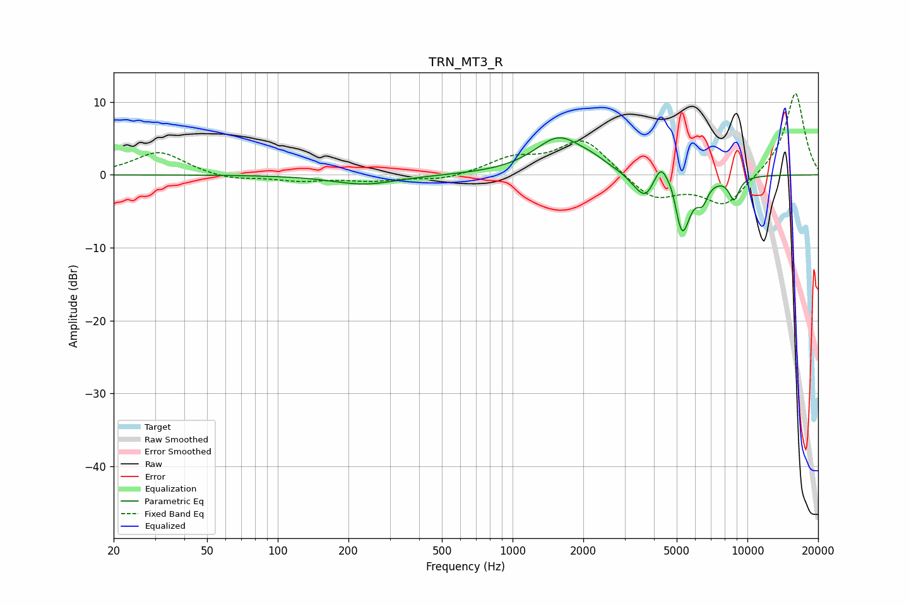

# TRN_MT3_R
See [usage instructions](https://github.com/jaakkopasanen/AutoEq#usage) for more options and info.

### Parametric EQs
Apply preamp of -5.2 dB when using parametric equalizer.

|   # | Type    |   Fc (Hz) |    Q |   Gain (dB) |
|-----|---------|-----------|------|-------------|
|   1 | Peaking |       234 | 1.03 |        -1.3 |
|   2 | Peaking |      1574 | 1.35 |         5   |
|   3 | Peaking |      2183 | 2.31 |         0.7 |
|   4 | Peaking |      3363 | 3.06 |        -1.1 |
|   5 | Peaking |      3694 | 3.85 |        -2.5 |
|   6 | Peaking |      4293 | 4.71 |         3.1 |
|   7 | Peaking |      4797 | 6    |         1.7 |
|   8 | Peaking |      5262 | 3.9  |        -8.5 |
|   9 | Peaking |      6437 | 6    |        -2.4 |
|  10 | Peaking |      8776 | 5.83 |        -3.1 |

### Fixed Band EQs
When using fixed band (also called graphic) equalizer, apply preamp of **-11.2 dB** (if available) and set gains manually with these parameters.

|   # | Type    |   Fc (Hz) |    Q |   Gain (dB) |
|-----|---------|-----------|------|-------------|
|   1 | Peaking |        31 | 1.41 |         3.2 |
|   2 | Peaking |        62 | 1.41 |        -0.7 |
|   3 | Peaking |       125 | 1.41 |        -0.8 |
|   4 | Peaking |       250 | 1.41 |        -0.7 |
|   5 | Peaking |       500 | 1.41 |        -0.7 |
|   6 | Peaking |      1000 | 1.41 |         2   |
|   7 | Peaking |      2000 | 1.41 |         4.9 |
|   8 | Peaking |      4000 | 1.41 |        -3.4 |
|   9 | Peaking |      8000 | 1.41 |        -4.3 |
|  10 | Peaking |     16000 | 1.41 |        11.5 |

### Graphs

