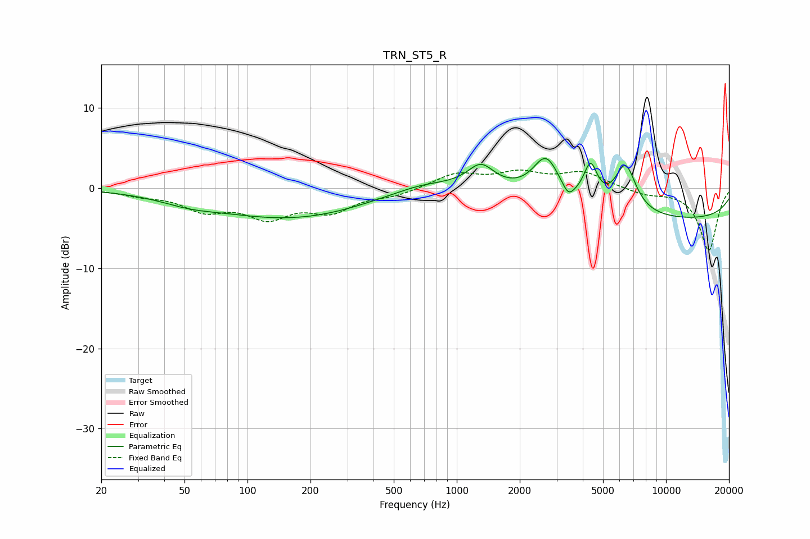

# TRN_ST5_R
See [usage instructions](https://github.com/jaakkopasanen/AutoEq#usage) for more options and info.

### Parametric EQs
Apply preamp of -3.8 dB when using parametric equalizer.

|   # | Type    |   Fc (Hz) |    Q |   Gain (dB) |
|-----|---------|-----------|------|-------------|
|   1 | Peaking |        52 | 1.03 |        -0.8 |
|   2 | Peaking |       177 | 0.36 |        -4   |
|   3 | Peaking |       667 | 1.24 |         0.5 |
|   4 | Peaking |       802 | 0.36 |         1.4 |
|   5 | Peaking |      1306 | 2.28 |         2.7 |
|   6 | Peaking |      2674 | 2.22 |         5.2 |
|   7 | Peaking |      3410 | 5.23 |        -1.4 |
|   8 | Peaking |      4361 | 4.25 |         4.5 |
|   9 | Peaking |      6405 | 2.71 |         5.9 |
|  10 | Peaking |     10000 | 0.18 |        -4   |

### Fixed Band EQs
When using fixed band (also called graphic) equalizer, apply preamp of **-2.3 dB** (if available) and set gains manually with these parameters.

|   # | Type    |   Fc (Hz) |    Q |   Gain (dB) |
|-----|---------|-----------|------|-------------|
|   1 | Peaking |        31 | 1.41 |        -0.7 |
|   2 | Peaking |        62 | 1.41 |        -2.4 |
|   3 | Peaking |       125 | 1.41 |        -3.2 |
|   4 | Peaking |       250 | 1.41 |        -2.6 |
|   5 | Peaking |       500 | 1.41 |        -0.8 |
|   6 | Peaking |      1000 | 1.41 |         1.8 |
|   7 | Peaking |      2000 | 1.41 |         1.7 |
|   8 | Peaking |      4000 | 1.41 |         1.9 |
|   9 | Peaking |      8000 | 1.41 |        -0.7 |
|  10 | Peaking |     16000 | 1.41 |        -7.8 |

### Graphs

