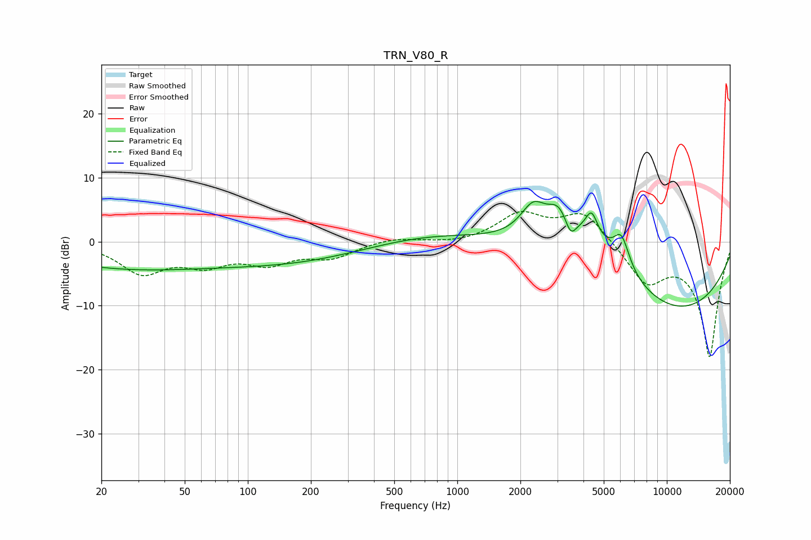

# TRN_V80_R
See [usage instructions](https://github.com/jaakkopasanen/AutoEq#usage) for more options and info.

### Parametric EQs
Apply preamp of -6.4 dB when using parametric equalizer.

|   # | Type    |   Fc (Hz) |    Q |   Gain (dB) |
|-----|---------|-----------|------|-------------|
|   1 | Peaking |        25 | 0.35 |        -3.8 |
|   2 | Peaking |       168 | 0.37 |        -3.1 |
|   3 | Peaking |       732 | 0.44 |         1.8 |
|   4 | Peaking |      2302 | 2.32 |         4.7 |
|   5 | Peaking |      3036 | 2.84 |         3.4 |
|   6 | Peaking |      3473 | 5.41 |        -2.7 |
|   7 | Peaking |      4124 | 0.59 |         9.7 |
|   8 | Peaking |      4371 | 4.99 |         3.7 |
|   9 | Peaking |      6067 | 3.58 |         5.1 |
|  10 | Peaking |      8822 | 0.26 |       -13.3 |

### Fixed Band EQs
When using fixed band (also called graphic) equalizer, apply preamp of **-4.8 dB** (if available) and set gains manually with these parameters.

|   # | Type    |   Fc (Hz) |    Q |   Gain (dB) |
|-----|---------|-----------|------|-------------|
|   1 | Peaking |        31 | 1.41 |        -4.6 |
|   2 | Peaking |        62 | 1.41 |        -3   |
|   3 | Peaking |       125 | 1.41 |        -2.9 |
|   4 | Peaking |       250 | 1.41 |        -2.2 |
|   5 | Peaking |       500 | 1.41 |         0.7 |
|   6 | Peaking |      1000 | 1.41 |        -0.4 |
|   7 | Peaking |      2000 | 1.41 |         4.2 |
|   8 | Peaking |      4000 | 1.41 |         4.7 |
|   9 | Peaking |      8000 | 1.41 |        -6   |
|  10 | Peaking |     16000 | 1.41 |       -17.9 |

### Graphs

