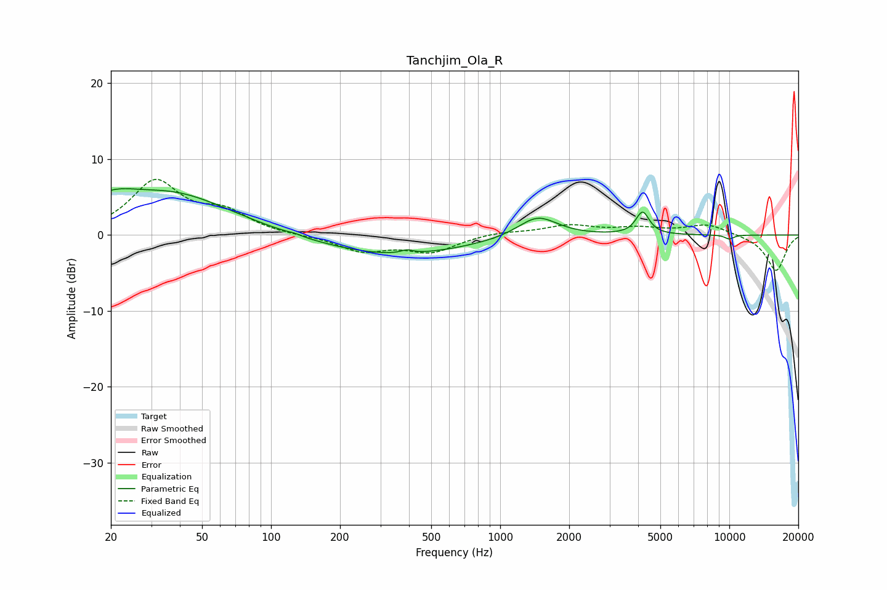

# Tanchjim_Ola_R
See [usage instructions](https://github.com/jaakkopasanen/AutoEq#usage) for more options and info.

### Parametric EQs
Apply preamp of -6.2 dB when using parametric equalizer.

|   # | Type    |   Fc (Hz) |    Q |   Gain (dB) |
|-----|---------|-----------|------|-------------|
|   1 | Peaking |        20 | 6    |         0.2 |
|   2 | Peaking |        21 | 1.52 |         2.1 |
|   3 | Peaking |        37 | 0.54 |         5.4 |
|   4 | Peaking |       127 | 5.93 |         0.2 |
|   5 | Peaking |       341 | 0.43 |        -2.7 |
|   6 | Peaking |       392 | 5.57 |         0.5 |
|   7 | Peaking |      1455 | 1.63 |         2.8 |
|   8 | Peaking |      4173 | 4.75 |         1.4 |
|   9 | Peaking |      4189 | 5.13 |         1.5 |
|  10 | Peaking |     10000 | 6    |        -0.5 |

### Fixed Band EQs
When using fixed band (also called graphic) equalizer, apply preamp of **-7.4 dB** (if available) and set gains manually with these parameters.

|   # | Type    |   Fc (Hz) |    Q |   Gain (dB) |
|-----|---------|-----------|------|-------------|
|   1 | Peaking |        31 | 1.41 |         6.9 |
|   2 | Peaking |        62 | 1.41 |         2.6 |
|   3 | Peaking |       125 | 1.41 |        -0.1 |
|   4 | Peaking |       250 | 1.41 |        -2   |
|   5 | Peaking |       500 | 1.41 |        -2.1 |
|   6 | Peaking |      1000 | 1.41 |         0.4 |
|   7 | Peaking |      2000 | 1.41 |         1.2 |
|   8 | Peaking |      4000 | 1.41 |         0.8 |
|   9 | Peaking |      8000 | 1.41 |         1.4 |
|  10 | Peaking |     16000 | 1.41 |        -4.7 |

### Graphs

