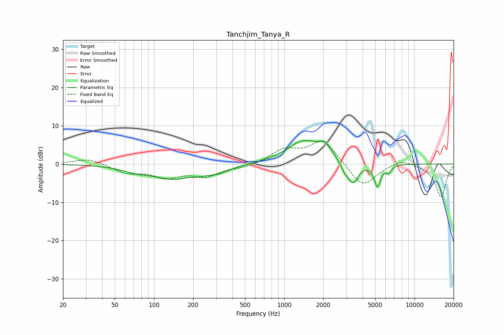

# Tanchjim_Tanya_R
See [usage instructions](https://github.com/jaakkopasanen/AutoEq#usage) for more options and info.

### Parametric EQs
Apply preamp of -6.3 dB when using parametric equalizer.

|   # | Type    |   Fc (Hz) |    Q |   Gain (dB) |
|-----|---------|-----------|------|-------------|
|   1 | Peaking |        71 | 1.6  |        -0.9 |
|   2 | Peaking |       158 | 0.68 |        -4.1 |
|   3 | Peaking |       177 | 3.26 |         0.5 |
|   4 | Peaking |       316 | 2.16 |        -0.9 |
|   5 | Peaking |      1428 | 1.06 |         6   |
|   6 | Peaking |      2062 | 3.09 |         2.7 |
|   7 | Peaking |      2892 | 5.48 |        -1.5 |
|   8 | Peaking |      3356 | 3.34 |        -5.7 |
|   9 | Peaking |      5201 | 5.85 |        -5.7 |
|  10 | Peaking |      6326 | 6    |        -1.7 |

### Fixed Band EQs
When using fixed band (also called graphic) equalizer, apply preamp of **-6.0 dB** (if available) and set gains manually with these parameters.

|   # | Type    |   Fc (Hz) |    Q |   Gain (dB) |
|-----|---------|-----------|------|-------------|
|   1 | Peaking |        31 | 1.41 |         1.5 |
|   2 | Peaking |        62 | 1.41 |        -2.2 |
|   3 | Peaking |       125 | 1.41 |        -3.1 |
|   4 | Peaking |       250 | 1.41 |        -2.9 |
|   5 | Peaking |       500 | 1.41 |        -0.8 |
|   6 | Peaking |      1000 | 1.41 |         3.5 |
|   7 | Peaking |      2000 | 1.41 |         6.4 |
|   8 | Peaking |      4000 | 1.41 |        -6.3 |
|   9 | Peaking |      8000 | 1.41 |         1.6 |
|  10 | Peaking |     16000 | 1.41 |        -8.6 |

### Graphs

