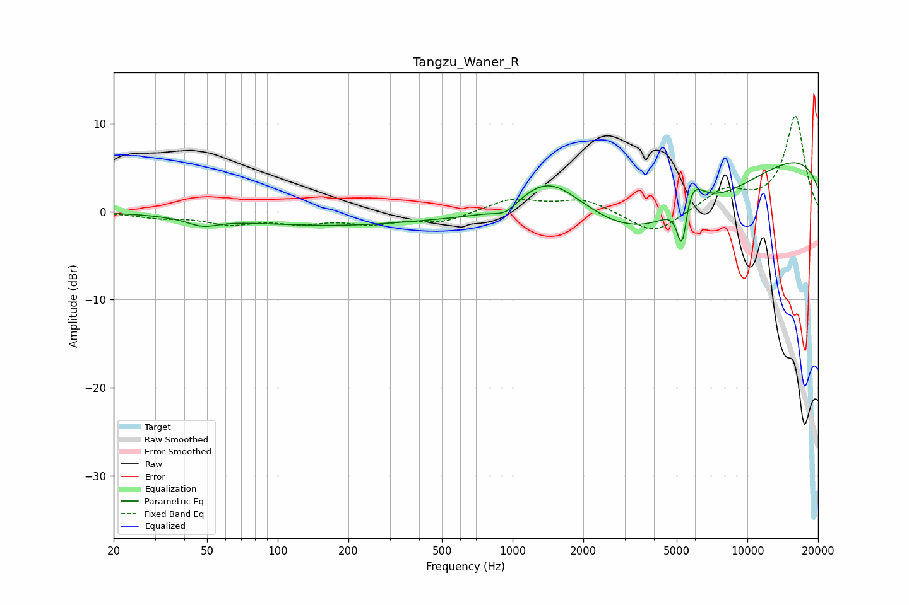

# Tangzu_Waner_R
See [usage instructions](https://github.com/jaakkopasanen/AutoEq#usage) for more options and info.

### Parametric EQs
Apply preamp of -5.6 dB when using parametric equalizer.

|   # | Type    |   Fc (Hz) |    Q |   Gain (dB) |
|-----|---------|-----------|------|-------------|
|   1 | Peaking |        48 | 2.15 |        -0.9 |
|   2 | Peaking |        73 | 0.51 |        -0.5 |
|   3 | Peaking |       193 | 0.45 |        -1.3 |
|   4 | Peaking |       933 | 2.82 |        -1.1 |
|   5 | Peaking |      1400 | 0.98 |         5.3 |
|   6 | Peaking |      1854 | 0.81 |         1.5 |
|   7 | Peaking |      3761 | 0.33 |        -9.5 |
|   8 | Peaking |      5271 | 5.95 |        -6.8 |
|   9 | Peaking |      5629 | 2.51 |         5.1 |
|  10 | Peaking |     10000 | 0.18 |         8   |

### Fixed Band EQs
When using fixed band (also called graphic) equalizer, apply preamp of **-10.9 dB** (if available) and set gains manually with these parameters.

|   # | Type    |   Fc (Hz) |    Q |   Gain (dB) |
|-----|---------|-----------|------|-------------|
|   1 | Peaking |        31 | 1.41 |        -0.6 |
|   2 | Peaking |        62 | 1.41 |        -1.2 |
|   3 | Peaking |       125 | 1.41 |        -1.1 |
|   4 | Peaking |       250 | 1.41 |        -1.2 |
|   5 | Peaking |       500 | 1.41 |        -1.1 |
|   6 | Peaking |      1000 | 1.41 |         1.5 |
|   7 | Peaking |      2000 | 1.41 |         1.4 |
|   8 | Peaking |      4000 | 1.41 |        -2.7 |
|   9 | Peaking |      8000 | 1.41 |         2.3 |
|  10 | Peaking |     16000 | 1.41 |        10.8 |

### Graphs

