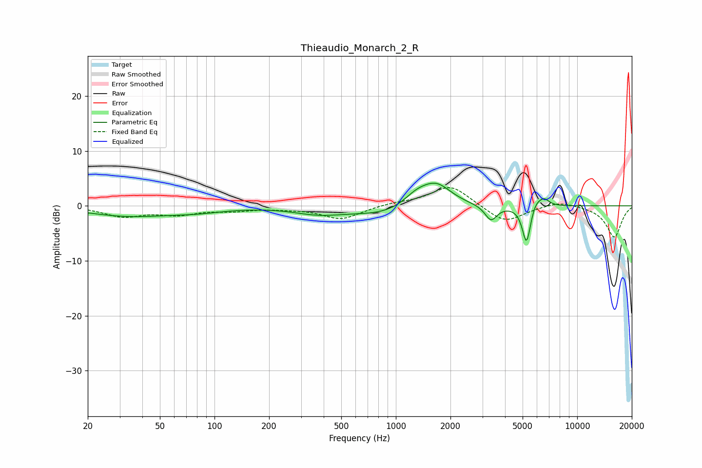

# Thieaudio_Monarch_2_R
See [usage instructions](https://github.com/jaakkopasanen/AutoEq#usage) for more options and info.

### Parametric EQs
Apply preamp of -4.2 dB when using parametric equalizer.

|   # | Type    |   Fc (Hz) |    Q |   Gain (dB) |
|-----|---------|-----------|------|-------------|
|   1 | Peaking |        34 | 0.61 |        -1.8 |
|   2 | Peaking |        80 | 0.91 |        -0.7 |
|   3 | Peaking |       373 | 1.06 |        -1.2 |
|   4 | Peaking |       924 | 0.68 |        -1.8 |
|   5 | Peaking |      1291 | 1.93 |         2.1 |
|   6 | Peaking |      1670 | 1.63 |         4.2 |
|   7 | Peaking |      3347 | 4.26 |        -2.8 |
|   8 | Peaking |      5259 | 5.88 |        -7.3 |
|   9 | Peaking |      5885 | 3.93 |         1.8 |
|  10 | Peaking |      6587 | 5.04 |         1.2 |

### Fixed Band EQs
When using fixed band (also called graphic) equalizer, apply preamp of **-3.4 dB** (if available) and set gains manually with these parameters.

|   # | Type    |   Fc (Hz) |    Q |   Gain (dB) |
|-----|---------|-----------|------|-------------|
|   1 | Peaking |        31 | 1.41 |        -1.8 |
|   2 | Peaking |        62 | 1.41 |        -1.4 |
|   3 | Peaking |       125 | 1.41 |        -0.7 |
|   4 | Peaking |       250 | 1.41 |        -0.3 |
|   5 | Peaking |       500 | 1.41 |        -2.4 |
|   6 | Peaking |      1000 | 1.41 |         0.5 |
|   7 | Peaking |      2000 | 1.41 |         3.8 |
|   8 | Peaking |      4000 | 1.41 |        -3.2 |
|   9 | Peaking |      8000 | 1.41 |         1   |
|  10 | Peaking |     16000 | 1.41 |        -5.7 |

### Graphs

