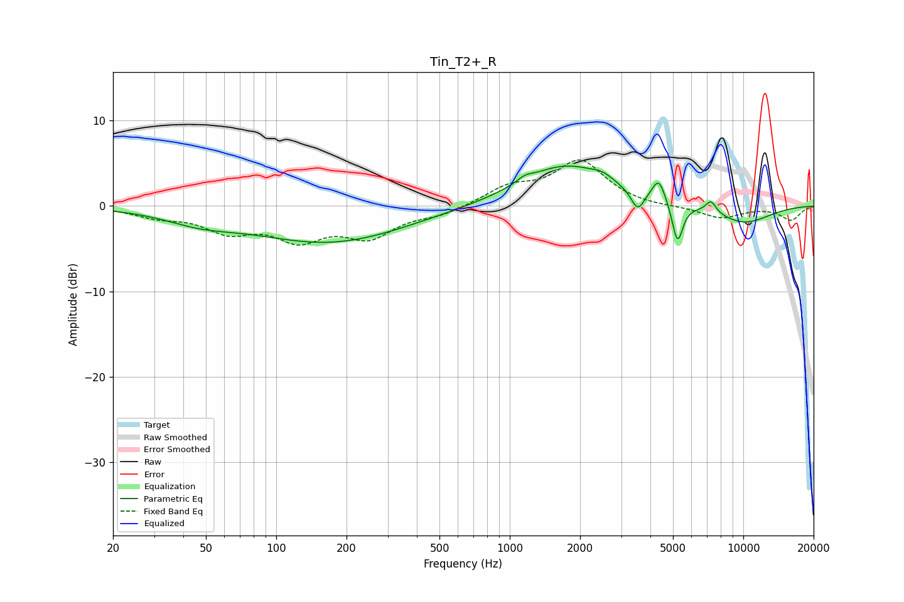

# Tin_T2+_R
See [usage instructions](https://github.com/jaakkopasanen/AutoEq#usage) for more options and info.

### Parametric EQs
Apply preamp of -4.8 dB when using parametric equalizer.

|   # | Type    |   Fc (Hz) |    Q |   Gain (dB) |
|-----|---------|-----------|------|-------------|
|   1 | Peaking |        47 | 0.92 |        -1.3 |
|   2 | Peaking |       170 | 0.43 |        -4.2 |
|   3 | Peaking |      1162 | 4.36 |         0.6 |
|   4 | Peaking |      1740 | 0.73 |         4.8 |
|   5 | Peaking |      2500 | 3.28 |         0.6 |
|   6 | Peaking |      3530 | 4.95 |        -2.4 |
|   7 | Peaking |      4345 | 4.95 |         2.7 |
|   8 | Peaking |      5227 | 6    |        -4.8 |
|   9 | Peaking |      7274 | 5.96 |         1.4 |
|  10 | Peaking |     10000 | 0.99 |        -2.1 |

### Fixed Band EQs
When using fixed band (also called graphic) equalizer, apply preamp of **-5.5 dB** (if available) and set gains manually with these parameters.

|   # | Type    |   Fc (Hz) |    Q |   Gain (dB) |
|-----|---------|-----------|------|-------------|
|   1 | Peaking |        31 | 1.41 |        -1.1 |
|   2 | Peaking |        62 | 1.41 |        -2.6 |
|   3 | Peaking |       125 | 1.41 |        -3.5 |
|   4 | Peaking |       250 | 1.41 |        -3.3 |
|   5 | Peaking |       500 | 1.41 |        -0.9 |
|   6 | Peaking |      1000 | 1.41 |         2   |
|   7 | Peaking |      2000 | 1.41 |         5.1 |
|   8 | Peaking |      4000 | 1.41 |        -0.2 |
|   9 | Peaking |      8000 | 1.41 |        -1.4 |
|  10 | Peaking |     16000 | 1.41 |        -1.6 |

### Graphs

