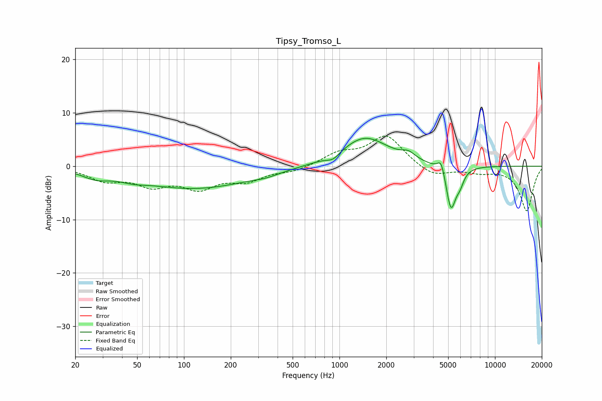

# Tipsy_Tromso_L
See [usage instructions](https://github.com/jaakkopasanen/AutoEq#usage) for more options and info.

### Parametric EQs
Apply preamp of -5.3 dB when using parametric equalizer.

|   # | Type    |   Fc (Hz) |    Q |   Gain (dB) |
|-----|---------|-----------|------|-------------|
|   1 | Peaking |        27 | 1.66 |        -1.4 |
|   2 | Peaking |        47 | 1.69 |        -0.7 |
|   3 | Peaking |       117 | 0.39 |        -4.1 |
|   4 | Peaking |       336 | 1.76 |        -0.5 |
|   5 | Peaking |       910 | 3.39 |        -1.1 |
|   6 | Peaking |      1457 | 0.93 |         5.5 |
|   7 | Peaking |      2779 | 3.4  |         1.2 |
|   8 | Peaking |      4514 | 6    |         2.7 |
|   9 | Peaking |      5213 | 4.22 |        -8.4 |
|  10 | Peaking |      5958 | 5.66 |        -1.9 |

### Fixed Band EQs
When using fixed band (also called graphic) equalizer, apply preamp of **-5.7 dB** (if available) and set gains manually with these parameters.

|   # | Type    |   Fc (Hz) |    Q |   Gain (dB) |
|-----|---------|-----------|------|-------------|
|   1 | Peaking |        31 | 1.41 |        -2.4 |
|   2 | Peaking |        62 | 1.41 |        -3.1 |
|   3 | Peaking |       125 | 1.41 |        -3.6 |
|   4 | Peaking |       250 | 1.41 |        -2.4 |
|   5 | Peaking |       500 | 1.41 |        -0.9 |
|   6 | Peaking |      1000 | 1.41 |         2.2 |
|   7 | Peaking |      2000 | 1.41 |         5.7 |
|   8 | Peaking |      4000 | 1.41 |        -2   |
|   9 | Peaking |      8000 | 1.41 |        -1   |
|  10 | Peaking |     16000 | 1.41 |        -8.3 |

### Graphs

