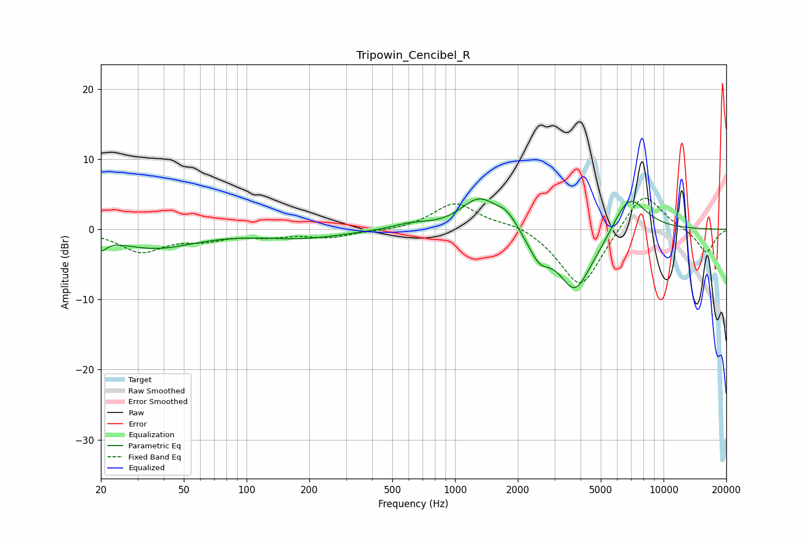

# Tripowin_Cencibel_R
See [usage instructions](https://github.com/jaakkopasanen/AutoEq#usage) for more options and info.

### Parametric EQs
Apply preamp of -4.4 dB when using parametric equalizer.

|   # | Type    |   Fc (Hz) |    Q |   Gain (dB) |
|-----|---------|-----------|------|-------------|
|   1 | Peaking |        20 | 5.35 |        -1.6 |
|   2 | Peaking |        36 | 0.74 |        -2.6 |
|   3 | Peaking |       186 | 0.7  |        -1.2 |
|   4 | Peaking |       612 | 1.72 |         0.7 |
|   5 | Peaking |      1308 | 1.58 |         4.5 |
|   6 | Peaking |      1771 | 2.8  |         1.8 |
|   7 | Peaking |      2532 | 2.68 |        -3.3 |
|   8 | Peaking |      3750 | 1.74 |        -8.4 |
|   9 | Peaking |      4943 | 1.71 |        -1.1 |
|  10 | Peaking |      6823 | 1.66 |         5.6 |

### Fixed Band EQs
When using fixed band (also called graphic) equalizer, apply preamp of **-4.5 dB** (if available) and set gains manually with these parameters.

|   # | Type    |   Fc (Hz) |    Q |   Gain (dB) |
|-----|---------|-----------|------|-------------|
|   1 | Peaking |        31 | 1.41 |        -3.1 |
|   2 | Peaking |        62 | 1.41 |        -1.2 |
|   3 | Peaking |       125 | 1.41 |        -0.8 |
|   4 | Peaking |       250 | 1.41 |        -1   |
|   5 | Peaking |       500 | 1.41 |        -0.3 |
|   6 | Peaking |      1000 | 1.41 |         3.8 |
|   7 | Peaking |      2000 | 1.41 |         1   |
|   8 | Peaking |      4000 | 1.41 |        -8.7 |
|   9 | Peaking |      8000 | 1.41 |         5.9 |
|  10 | Peaking |     16000 | 1.41 |        -3.4 |

### Graphs

