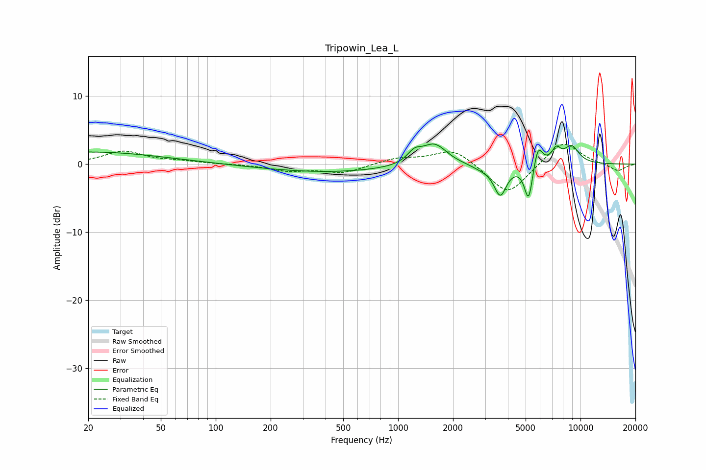

# Tripowin_Lea_L
See [usage instructions](https://github.com/jaakkopasanen/AutoEq#usage) for more options and info.

### Parametric EQs
Apply preamp of -3.1 dB when using parametric equalizer.

|   # | Type    |   Fc (Hz) |    Q |   Gain (dB) |
|-----|---------|-----------|------|-------------|
|   1 | Peaking |        20 | 0.34 |         1.8 |
|   2 | Peaking |       413 | 0.4  |        -1.2 |
|   3 | Peaking |      1229 | 3.57 |         1.5 |
|   4 | Peaking |      1582 | 2.06 |         3.1 |
|   5 | Peaking |      2887 | 2.29 |        -0.5 |
|   6 | Peaking |      3632 | 4.06 |        -4.4 |
|   7 | Peaking |      5196 | 6    |        -5.6 |
|   8 | Peaking |      5842 | 5.6  |         3.3 |
|   9 | Peaking |      7366 | 5.36 |         1.9 |
|  10 | Peaking |      8936 | 3.07 |         2.6 |

### Fixed Band EQs
When using fixed band (also called graphic) equalizer, apply preamp of **-3.0 dB** (if available) and set gains manually with these parameters.

|   # | Type    |   Fc (Hz) |    Q |   Gain (dB) |
|-----|---------|-----------|------|-------------|
|   1 | Peaking |        31 | 1.41 |         1.9 |
|   2 | Peaking |        62 | 1.41 |         0.4 |
|   3 | Peaking |       125 | 1.41 |         0   |
|   4 | Peaking |       250 | 1.41 |        -0.9 |
|   5 | Peaking |       500 | 1.41 |        -1.3 |
|   6 | Peaking |      1000 | 1.41 |         0.9 |
|   7 | Peaking |      2000 | 1.41 |         2.4 |
|   8 | Peaking |      4000 | 1.41 |        -4.7 |
|   9 | Peaking |      8000 | 1.41 |         3.6 |
|  10 | Peaking |     16000 | 1.41 |        -1.1 |

### Graphs

