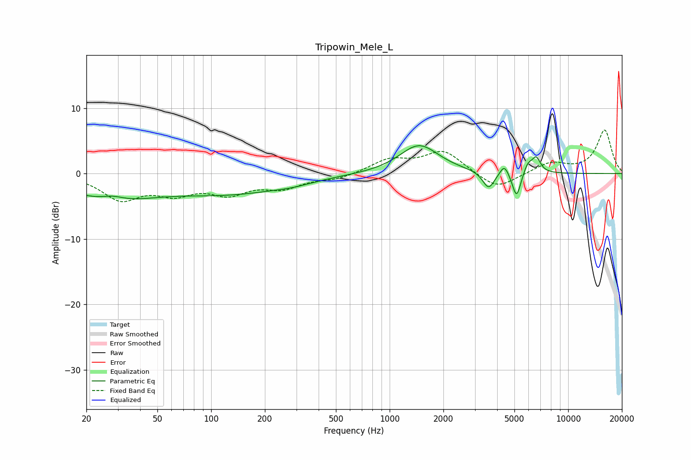

# Tripowin_Mele_L
See [usage instructions](https://github.com/jaakkopasanen/AutoEq#usage) for more options and info.

### Parametric EQs
Apply preamp of -4.4 dB when using parametric equalizer.

|   # | Type    |   Fc (Hz) |    Q |   Gain (dB) |
|-----|---------|-----------|------|-------------|
|   1 | Peaking |        27 | 0.59 |        -3.7 |
|   2 | Peaking |        28 | 2.14 |         0.9 |
|   3 | Peaking |       128 | 0.44 |        -2.8 |
|   4 | Peaking |       285 | 1.31 |        -0.4 |
|   5 | Peaking |      1463 | 1.29 |         4.4 |
|   6 | Peaking |      3582 | 4.27 |        -2.7 |
|   7 | Peaking |      4388 | 6    |         1.7 |
|   8 | Peaking |      5139 | 6    |        -3.9 |
|   9 | Peaking |      5954 | 5.99 |         1.5 |
|  10 | Peaking |      6622 | 5.67 |         2.3 |

### Fixed Band EQs
When using fixed band (also called graphic) equalizer, apply preamp of **-6.7 dB** (if available) and set gains manually with these parameters.

|   # | Type    |   Fc (Hz) |    Q |   Gain (dB) |
|-----|---------|-----------|------|-------------|
|   1 | Peaking |        31 | 1.41 |        -3.7 |
|   2 | Peaking |        62 | 1.41 |        -2.6 |
|   3 | Peaking |       125 | 1.41 |        -2.7 |
|   4 | Peaking |       250 | 1.41 |        -1.9 |
|   5 | Peaking |       500 | 1.41 |        -0.8 |
|   6 | Peaking |      1000 | 1.41 |         2   |
|   7 | Peaking |      2000 | 1.41 |         3.4 |
|   8 | Peaking |      4000 | 1.41 |        -2.6 |
|   9 | Peaking |      8000 | 1.41 |         1.6 |
|  10 | Peaking |     16000 | 1.41 |         6.6 |

### Graphs

