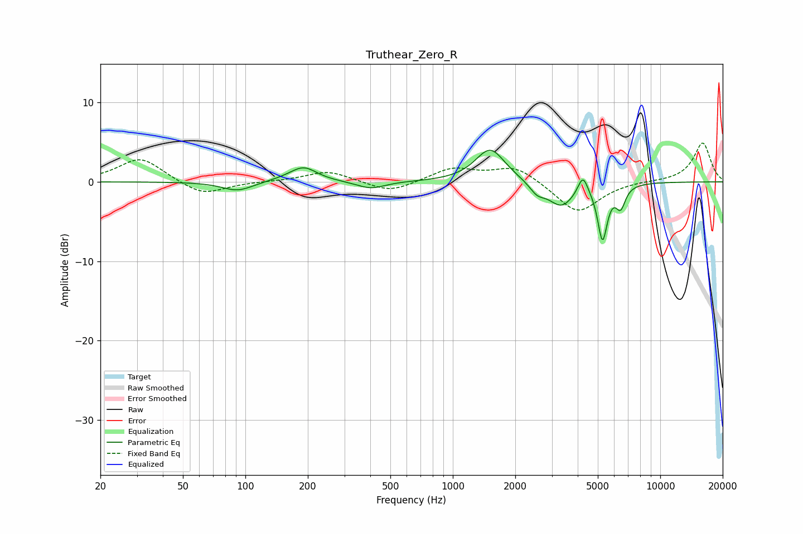

# Truthear_Zero_R
See [usage instructions](https://github.com/jaakkopasanen/AutoEq#usage) for more options and info.

### Parametric EQs
Apply preamp of -4.1 dB when using parametric equalizer.

|   # | Type    |   Fc (Hz) |    Q |   Gain (dB) |
|-----|---------|-----------|------|-------------|
|   1 | Peaking |        92 | 1.9  |        -1.2 |
|   2 | Peaking |       169 | 1.55 |         0.4 |
|   3 | Peaking |       192 | 2.26 |         1.6 |
|   4 | Peaking |       403 | 2.07 |        -0.9 |
|   5 | Peaking |      1516 | 1.97 |         4.2 |
|   6 | Peaking |      2549 | 3.81 |        -1.2 |
|   7 | Peaking |      3335 | 2.22 |        -3   |
|   8 | Peaking |      4237 | 6    |         2.4 |
|   9 | Peaking |      5268 | 6    |        -6.9 |
|  10 | Peaking |      6439 | 6    |        -2.6 |

### Fixed Band EQs
When using fixed band (also called graphic) equalizer, apply preamp of **-5.0 dB** (if available) and set gains manually with these parameters.

|   # | Type    |   Fc (Hz) |    Q |   Gain (dB) |
|-----|---------|-----------|------|-------------|
|   1 | Peaking |        31 | 1.41 |         3.1 |
|   2 | Peaking |        62 | 1.41 |        -1.8 |
|   3 | Peaking |       125 | 1.41 |         0   |
|   4 | Peaking |       250 | 1.41 |         1.4 |
|   5 | Peaking |       500 | 1.41 |        -1.4 |
|   6 | Peaking |      1000 | 1.41 |         1.7 |
|   7 | Peaking |      2000 | 1.41 |         2   |
|   8 | Peaking |      4000 | 1.41 |        -4   |
|   9 | Peaking |      8000 | 1.41 |         0.1 |
|  10 | Peaking |     16000 | 1.41 |         4.9 |

### Graphs

