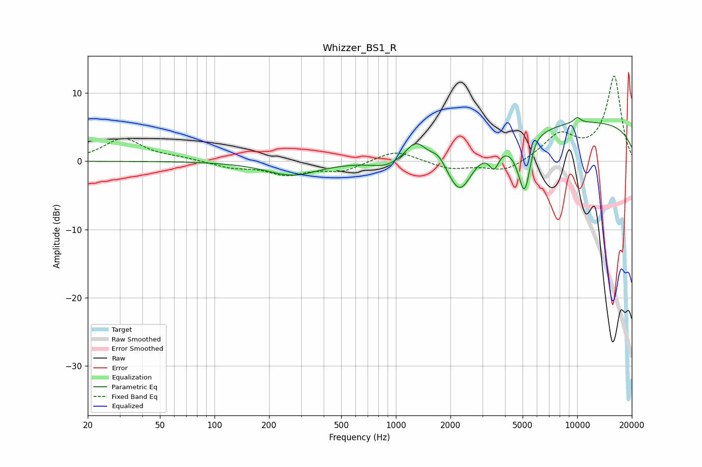

# Whizzer_BS1_R
See [usage instructions](https://github.com/jaakkopasanen/AutoEq#usage) for more options and info.

### Parametric EQs
Apply preamp of -6.5 dB when using parametric equalizer.

|   # | Type    |   Fc (Hz) |    Q |   Gain (dB) |
|-----|---------|-----------|------|-------------|
|   1 | Peaking |       269 | 0.97 |        -2.1 |
|   2 | Peaking |       893 | 1.58 |        -1.3 |
|   3 | Peaking |      1283 | 2.63 |         2.7 |
|   4 | Peaking |      1725 | 3.53 |         1.3 |
|   5 | Peaking |      2253 | 1.92 |        -7   |
|   6 | Peaking |      3482 | 5.13 |        -2.9 |
|   7 | Peaking |      5138 | 3.53 |        -9.8 |
|   8 | Peaking |      5729 | 3.27 |         1.8 |
|   9 | Peaking |     10000 | 6    |         0.8 |
|  10 | Peaking |     10000 | 0.18 |         5.9 |

### Fixed Band EQs
When using fixed band (also called graphic) equalizer, apply preamp of **-12.6 dB** (if available) and set gains manually with these parameters.

|   # | Type    |   Fc (Hz) |    Q |   Gain (dB) |
|-----|---------|-----------|------|-------------|
|   1 | Peaking |        31 | 1.41 |         3.3 |
|   2 | Peaking |        62 | 1.41 |         0.4 |
|   3 | Peaking |       125 | 1.41 |        -0.9 |
|   4 | Peaking |       250 | 1.41 |        -1.8 |
|   5 | Peaking |       500 | 1.41 |        -1.4 |
|   6 | Peaking |      1000 | 1.41 |         1.7 |
|   7 | Peaking |      2000 | 1.41 |        -1.1 |
|   8 | Peaking |      4000 | 1.41 |        -1.6 |
|   9 | Peaking |      8000 | 1.41 |         3.7 |
|  10 | Peaking |     16000 | 1.41 |        12.4 |

### Graphs

