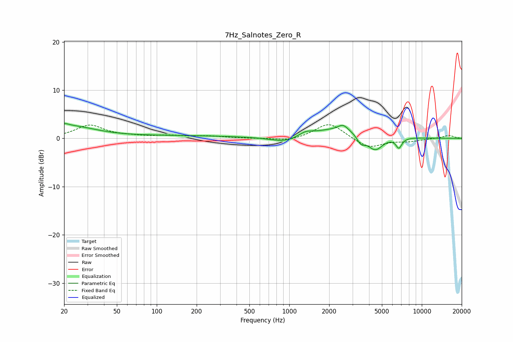

# 7Hz_Salnotes_Zero_R
See [usage instructions](https://github.com/jaakkopasanen/AutoEq#usage) for more options and info.

### Parametric EQs
Apply preamp of -3.2 dB when using parametric equalizer.

|   # | Type    |   Fc (Hz) |    Q |   Gain (dB) |
|-----|---------|-----------|------|-------------|
|   1 | Peaking |        20 | 5.07 |         0.5 |
|   2 | Peaking |        22 | 0.72 |         2.5 |
|   3 | Peaking |       157 | 0.33 |         0.5 |
|   4 | Peaking |       932 | 1.28 |        -1.3 |
|   5 | Peaking |      1327 | 2.81 |         0.8 |
|   6 | Peaking |      2529 | 0.62 |         2.2 |
|   7 | Peaking |      2540 | 3.94 |         1.1 |
|   8 | Peaking |      3473 | 4.43 |        -1.8 |
|   9 | Peaking |      4439 | 2.31 |        -3.4 |
|  10 | Peaking |      6715 | 6    |        -2.1 |

### Fixed Band EQs
When using fixed band (also called graphic) equalizer, apply preamp of **-2.9 dB** (if available) and set gains manually with these parameters.

|   # | Type    |   Fc (Hz) |    Q |   Gain (dB) |
|-----|---------|-----------|------|-------------|
|   1 | Peaking |        31 | 1.41 |         2.7 |
|   2 | Peaking |        62 | 1.41 |         0.3 |
|   3 | Peaking |       125 | 1.41 |         0.5 |
|   4 | Peaking |       250 | 1.41 |         0.4 |
|   5 | Peaking |       500 | 1.41 |         0   |
|   6 | Peaking |      1000 | 1.41 |        -0.6 |
|   7 | Peaking |      2000 | 1.41 |         3.3 |
|   8 | Peaking |      4000 | 1.41 |        -2.1 |
|   9 | Peaking |      8000 | 1.41 |        -0.5 |
|  10 | Peaking |     16000 | 1.41 |         0.6 |

### Graphs

