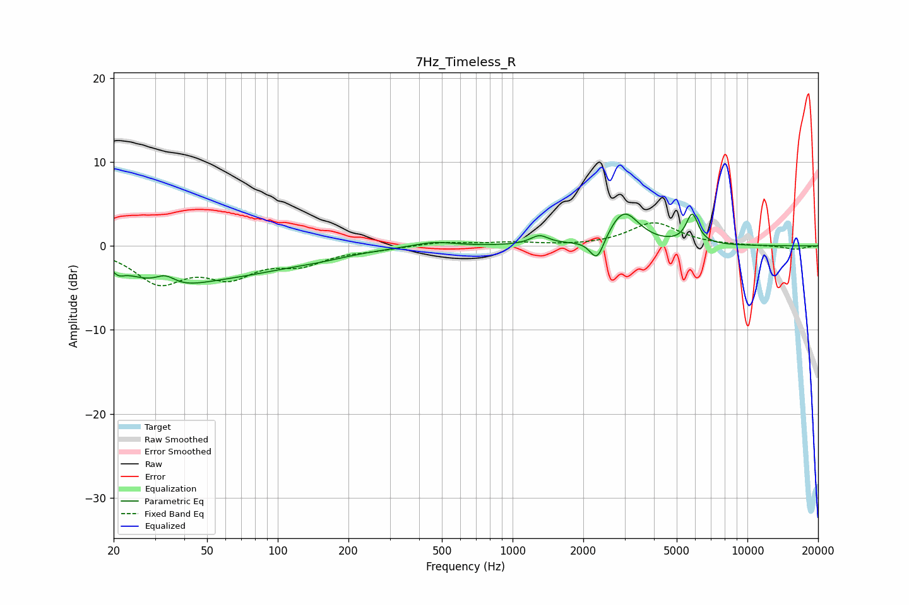

# 7Hz_Timeless_R
See [usage instructions](https://github.com/jaakkopasanen/AutoEq#usage) for more options and info.

### Parametric EQs
Apply preamp of -3.9 dB when using parametric equalizer.

|   # | Type    |   Fc (Hz) |    Q |   Gain (dB) |
|-----|---------|-----------|------|-------------|
|   1 | Peaking |        21 | 5.93 |        -0.8 |
|   2 | Peaking |        33 | 0.83 |        -3.7 |
|   3 | Peaking |        33 | 3.15 |         1.4 |
|   4 | Peaking |        72 | 0.57 |        -2.3 |
|   5 | Peaking |       152 | 1.07 |        -0.5 |
|   6 | Peaking |       461 | 1.63 |         0.6 |
|   7 | Peaking |      1302 | 3.7  |         1.1 |
|   8 | Peaking |      2290 | 4.72 |        -2.9 |
|   9 | Peaking |      2977 | 2.21 |         4.1 |
|  10 | Peaking |      5822 | 5.46 |         3.5 |

### Fixed Band EQs
When using fixed band (also called graphic) equalizer, apply preamp of **-2.8 dB** (if available) and set gains manually with these parameters.

|   # | Type    |   Fc (Hz) |    Q |   Gain (dB) |
|-----|---------|-----------|------|-------------|
|   1 | Peaking |        31 | 1.41 |        -4.1 |
|   2 | Peaking |        62 | 1.41 |        -3.1 |
|   3 | Peaking |       125 | 1.41 |        -1.9 |
|   4 | Peaking |       250 | 1.41 |        -0.4 |
|   5 | Peaking |       500 | 1.41 |         0.5 |
|   6 | Peaking |      1000 | 1.41 |         0.4 |
|   7 | Peaking |      2000 | 1.41 |        -0.1 |
|   8 | Peaking |      4000 | 1.41 |         2.7 |
|   9 | Peaking |      8000 | 1.41 |         0   |
|  10 | Peaking |     16000 | 1.41 |        -0.4 |

### Graphs

