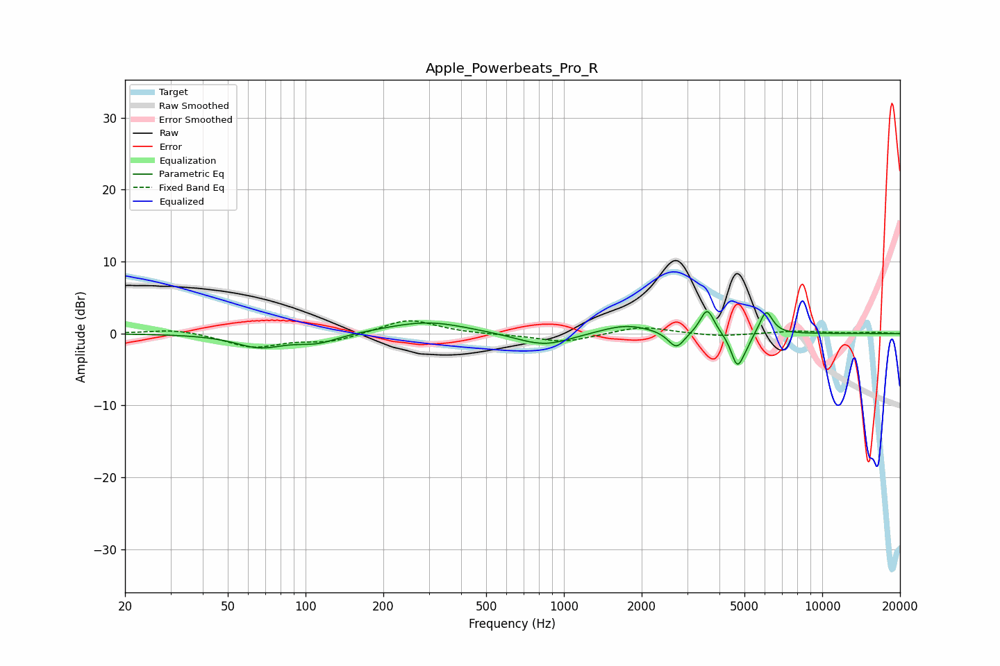

# Apple_Powerbeats_Pro_R
See [usage instructions](https://github.com/jaakkopasanen/AutoEq#usage) for more options and info.

### Parametric EQs
Apply preamp of -3.2 dB when using parametric equalizer.

|   # | Type    |   Fc (Hz) |    Q |   Gain (dB) |
|-----|---------|-----------|------|-------------|
|   1 | Peaking |        66 | 1.51 |        -1.8 |
|   2 | Peaking |       111 | 1.74 |        -1.2 |
|   3 | Peaking |       295 | 0.9  |         1.7 |
|   4 | Peaking |       838 | 1.31 |        -1.9 |
|   5 | Peaking |      1736 | 1.37 |         1.4 |
|   6 | Peaking |      2726 | 4.45 |        -2.4 |
|   7 | Peaking |      3586 | 5.28 |         3.6 |
|   8 | Peaking |      4683 | 5.88 |        -4.2 |
|   9 | Peaking |      5032 | 4.93 |        -1.2 |
|  10 | Peaking |      6062 | 5.45 |         3.4 |

### Fixed Band EQs
When using fixed band (also called graphic) equalizer, apply preamp of **-1.9 dB** (if available) and set gains manually with these parameters.

|   # | Type    |   Fc (Hz) |    Q |   Gain (dB) |
|-----|---------|-----------|------|-------------|
|   1 | Peaking |        31 | 1.41 |         0.7 |
|   2 | Peaking |        62 | 1.41 |        -1.9 |
|   3 | Peaking |       125 | 1.41 |        -1.1 |
|   4 | Peaking |       250 | 1.41 |         2.1 |
|   5 | Peaking |       500 | 1.41 |        -0.1 |
|   6 | Peaking |      1000 | 1.41 |        -1.2 |
|   7 | Peaking |      2000 | 1.41 |         1   |
|   8 | Peaking |      4000 | 1.41 |        -0.4 |
|   9 | Peaking |      8000 | 1.41 |         0.4 |
|  10 | Peaking |     16000 | 1.41 |         0.2 |

### Graphs

