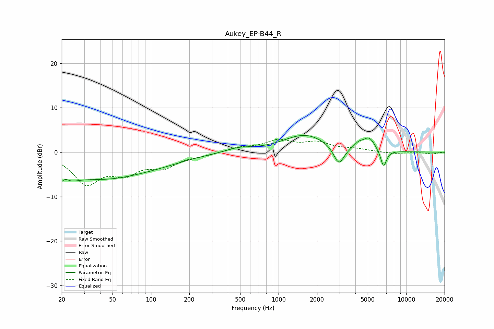

# Aukey_EP-B44_R
See [usage instructions](https://github.com/jaakkopasanen/AutoEq#usage) for more options and info.

### Parametric EQs
Apply preamp of -3.9 dB when using parametric equalizer.

|   # | Type    |   Fc (Hz) |    Q |   Gain (dB) |
|-----|---------|-----------|------|-------------|
|   1 | Peaking |        20 | 1.99 |        -6   |
|   2 | Peaking |        21 | 3.69 |         3.3 |
|   3 | Peaking |        43 | 0.43 |        -5.4 |
|   4 | Peaking |       120 | 0.64 |        -1   |
|   5 | Peaking |       489 | 1.42 |         0.9 |
|   6 | Peaking |      1617 | 0.82 |         3.9 |
|   7 | Peaking |      2968 | 3.39 |        -4.3 |
|   8 | Peaking |      4234 | 3.86 |         1.2 |
|   9 | Peaking |      5125 | 2.97 |         2.8 |
|  10 | Peaking |      6647 | 5.75 |        -4   |

### Fixed Band EQs
When using fixed band (also called graphic) equalizer, apply preamp of **-3.0 dB** (if available) and set gains manually with these parameters.

|   # | Type    |   Fc (Hz) |    Q |   Gain (dB) |
|-----|---------|-----------|------|-------------|
|   1 | Peaking |        31 | 1.41 |        -6.7 |
|   2 | Peaking |        62 | 1.41 |        -3.9 |
|   3 | Peaking |       125 | 1.41 |        -2.9 |
|   4 | Peaking |       250 | 1.41 |        -0.6 |
|   5 | Peaking |       500 | 1.41 |         0.9 |
|   6 | Peaking |      1000 | 1.41 |         2.4 |
|   7 | Peaking |      2000 | 1.41 |         2   |
|   8 | Peaking |      4000 | 1.41 |         0.6 |
|   9 | Peaking |      8000 | 1.41 |        -0.4 |
|  10 | Peaking |     16000 | 1.41 |        -0.4 |

### Graphs

