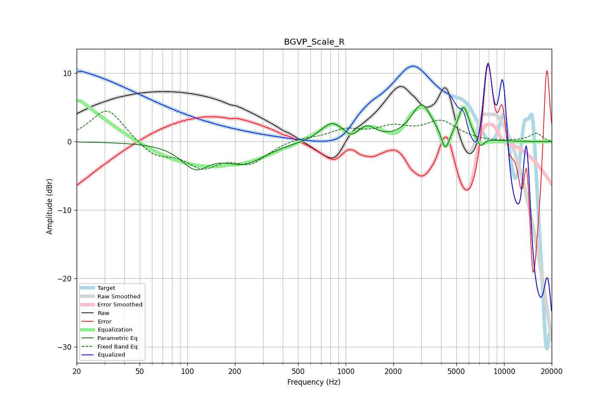

# BGVP_Scale_R
See [usage instructions](https://github.com/jaakkopasanen/AutoEq#usage) for more options and info.

### Parametric EQs
Apply preamp of -5.5 dB when using parametric equalizer.

|   # | Type    |   Fc (Hz) |    Q |   Gain (dB) |
|-----|---------|-----------|------|-------------|
|   1 | Peaking |       112 | 1.65 |        -3.4 |
|   2 | Peaking |       229 | 1.08 |        -2.9 |
|   3 | Peaking |       815 | 2.01 |         2.7 |
|   4 | Peaking |      1077 | 4.84 |        -0.6 |
|   5 | Peaking |      1151 | 2.64 |        -0.1 |
|   6 | Peaking |      1368 | 2.8  |         1.7 |
|   7 | Peaking |      3018 | 2.17 |         5.3 |
|   8 | Peaking |      4260 | 5.82 |        -3.1 |
|   9 | Peaking |      5561 | 4.03 |         4.8 |
|  10 | Peaking |      7097 | 5.92 |        -1.5 |

### Fixed Band EQs
When using fixed band (also called graphic) equalizer, apply preamp of **-4.6 dB** (if available) and set gains manually with these parameters.

|   # | Type    |   Fc (Hz) |    Q |   Gain (dB) |
|-----|---------|-----------|------|-------------|
|   1 | Peaking |        31 | 1.41 |         5   |
|   2 | Peaking |        62 | 1.41 |        -2.1 |
|   3 | Peaking |       125 | 1.41 |        -3.3 |
|   4 | Peaking |       250 | 1.41 |        -2.9 |
|   5 | Peaking |       500 | 1.41 |         0.6 |
|   6 | Peaking |      1000 | 1.41 |         1.6 |
|   7 | Peaking |      2000 | 1.41 |         1.8 |
|   8 | Peaking |      4000 | 1.41 |         2.8 |
|   9 | Peaking |      8000 | 1.41 |        -0.1 |
|  10 | Peaking |     16000 | 1.41 |         1.2 |

### Graphs

