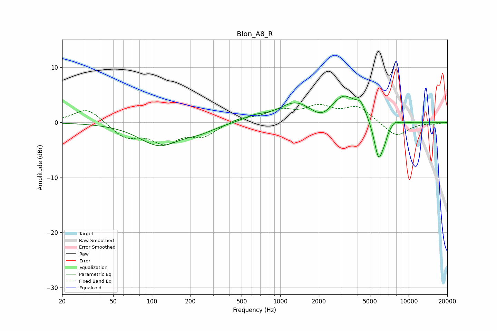

# Blon_A8_R
See [usage instructions](https://github.com/jaakkopasanen/AutoEq#usage) for more options and info.

### Parametric EQs
Apply preamp of -4.9 dB when using parametric equalizer.

|   # | Type    |   Fc (Hz) |    Q |   Gain (dB) |
|-----|---------|-----------|------|-------------|
|   1 | Peaking |       114 | 0.9  |        -4   |
|   2 | Peaking |       237 | 1.22 |        -1.1 |
|   3 | Peaking |       629 | 1.58 |         0.9 |
|   4 | Peaking |      1308 | 1.12 |         3.3 |
|   5 | Peaking |      2110 | 1.87 |        -1.6 |
|   6 | Peaking |      3138 | 1.41 |         4.6 |
|   7 | Peaking |      4256 | 3.63 |         2   |
|   8 | Peaking |      5840 | 3.74 |        -7.2 |
|   9 | Peaking |      6499 | 5.99 |        -1.2 |
|  10 | Peaking |      7826 | 5.72 |         0.6 |

### Fixed Band EQs
When using fixed band (also called graphic) equalizer, apply preamp of **-3.4 dB** (if available) and set gains manually with these parameters.

|   # | Type    |   Fc (Hz) |    Q |   Gain (dB) |
|-----|---------|-----------|------|-------------|
|   1 | Peaking |        31 | 1.41 |         2.7 |
|   2 | Peaking |        62 | 1.41 |        -2.6 |
|   3 | Peaking |       125 | 1.41 |        -3.3 |
|   4 | Peaking |       250 | 1.41 |        -2.3 |
|   5 | Peaking |       500 | 1.41 |         0.8 |
|   6 | Peaking |      1000 | 1.41 |         2   |
|   7 | Peaking |      2000 | 1.41 |         2.5 |
|   8 | Peaking |      4000 | 1.41 |         2.7 |
|   9 | Peaking |      8000 | 1.41 |        -2.6 |
|  10 | Peaking |     16000 | 1.41 |        -0.2 |

### Graphs

