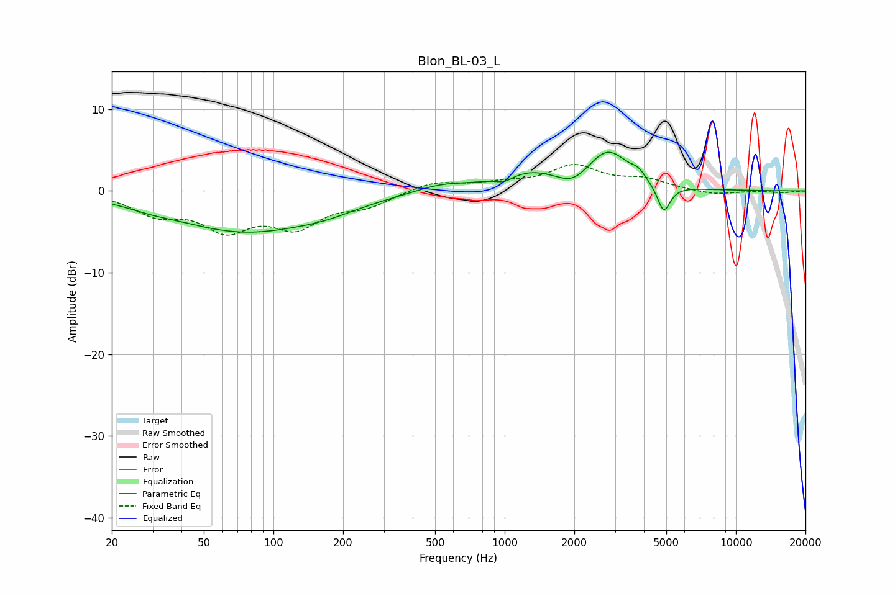

# Blon_BL-03_L
See [usage instructions](https://github.com/jaakkopasanen/AutoEq#usage) for more options and info.

### Parametric EQs
Apply preamp of -4.8 dB when using parametric equalizer.

|   # | Type    |   Fc (Hz) |    Q |   Gain (dB) |
|-----|---------|-----------|------|-------------|
|   1 | Peaking |        29 | 1.5  |        -0.4 |
|   2 | Peaking |        75 | 0.45 |        -4.8 |
|   3 | Peaking |       170 | 1.03 |        -0.8 |
|   4 | Peaking |       528 | 1.27 |         0.9 |
|   5 | Peaking |       998 | 3.76 |        -0.7 |
|   6 | Peaking |      1282 | 1    |         2.1 |
|   7 | Peaking |      1970 | 2.1  |        -1.5 |
|   8 | Peaking |      2795 | 1.57 |         4.7 |
|   9 | Peaking |      3785 | 4.76 |         0.8 |
|  10 | Peaking |      4875 | 4.95 |        -3.5 |

### Fixed Band EQs
When using fixed band (also called graphic) equalizer, apply preamp of **-3.3 dB** (if available) and set gains manually with these parameters.

|   # | Type    |   Fc (Hz) |    Q |   Gain (dB) |
|-----|---------|-----------|------|-------------|
|   1 | Peaking |        31 | 1.41 |        -2.5 |
|   2 | Peaking |        62 | 1.41 |        -4.2 |
|   3 | Peaking |       125 | 1.41 |        -3.9 |
|   4 | Peaking |       250 | 1.41 |        -1.6 |
|   5 | Peaking |       500 | 1.41 |         1.2 |
|   6 | Peaking |      1000 | 1.41 |         0.7 |
|   7 | Peaking |      2000 | 1.41 |         2.9 |
|   8 | Peaking |      4000 | 1.41 |         1.2 |
|   9 | Peaking |      8000 | 1.41 |        -0.5 |
|  10 | Peaking |     16000 | 1.41 |        -0.2 |

### Graphs

