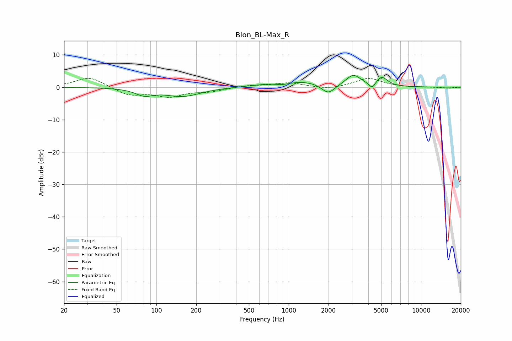

# Blon_BL-Max_R
See [usage instructions](https://github.com/jaakkopasanen/AutoEq#usage) for more options and info.

### Parametric EQs
Apply preamp of -3.7 dB when using parametric equalizer.

|   # | Type    |   Fc (Hz) |    Q |   Gain (dB) |
|-----|---------|-----------|------|-------------|
|   1 | Peaking |        81 | 2.11 |        -2   |
|   2 | Peaking |       158 | 1.05 |        -2.7 |
|   3 | Peaking |       390 | 0.85 |        -0.1 |
|   4 | Peaking |       899 | 2.41 |        -0.8 |
|   5 | Peaking |      1019 | 0.66 |         1.7 |
|   6 | Peaking |      1487 | 1.24 |         0.4 |
|   7 | Peaking |      1989 | 2.73 |        -3.2 |
|   8 | Peaking |      3079 | 2.51 |         3.5 |
|   9 | Peaking |      4278 | 5.95 |        -2   |
|  10 | Peaking |      5047 | 3.22 |         2.9 |

### Fixed Band EQs
When using fixed band (also called graphic) equalizer, apply preamp of **-2.8 dB** (if available) and set gains manually with these parameters.

|   # | Type    |   Fc (Hz) |    Q |   Gain (dB) |
|-----|---------|-----------|------|-------------|
|   1 | Peaking |        31 | 1.41 |         3.2 |
|   2 | Peaking |        62 | 1.41 |        -2.4 |
|   3 | Peaking |       125 | 1.41 |        -2.6 |
|   4 | Peaking |       250 | 1.41 |        -1.1 |
|   5 | Peaking |       500 | 1.41 |         0.5 |
|   6 | Peaking |      1000 | 1.41 |         1.3 |
|   7 | Peaking |      2000 | 1.41 |        -0.8 |
|   8 | Peaking |      4000 | 1.41 |         2.8 |
|   9 | Peaking |      8000 | 1.41 |        -0.1 |
|  10 | Peaking |     16000 | 1.41 |        -0.3 |

### Graphs

