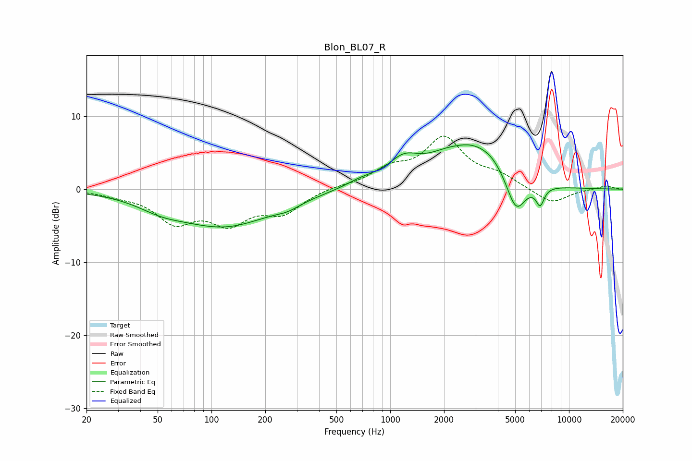

# Blon_BL07_R
See [usage instructions](https://github.com/jaakkopasanen/AutoEq#usage) for more options and info.

### Parametric EQs
Apply preamp of -6.2 dB when using parametric equalizer.

|   # | Type    |   Fc (Hz) |    Q |   Gain (dB) |
|-----|---------|-----------|------|-------------|
|   1 | Peaking |        52 | 1.08 |        -1.3 |
|   2 | Peaking |       119 | 0.53 |        -4.9 |
|   3 | Peaking |       267 | 2.03 |        -0.7 |
|   4 | Peaking |       696 | 1.51 |         0.9 |
|   5 | Peaking |      1183 | 1.61 |         2.8 |
|   6 | Peaking |      2405 | 1.89 |        -0.9 |
|   7 | Peaking |      2507 | 0.88 |         6.4 |
|   8 | Peaking |      3683 | 1.66 |         1.5 |
|   9 | Peaking |      5052 | 2.57 |        -4.9 |
|  10 | Peaking |      6897 | 6    |        -2.4 |

### Fixed Band EQs
When using fixed band (also called graphic) equalizer, apply preamp of **-7.4 dB** (if available) and set gains manually with these parameters.

|   # | Type    |   Fc (Hz) |    Q |   Gain (dB) |
|-----|---------|-----------|------|-------------|
|   1 | Peaking |        31 | 1.41 |        -0.6 |
|   2 | Peaking |        62 | 1.41 |        -4.1 |
|   3 | Peaking |       125 | 1.41 |        -4.1 |
|   4 | Peaking |       250 | 1.41 |        -3   |
|   5 | Peaking |       500 | 1.41 |         0.3 |
|   6 | Peaking |      1000 | 1.41 |         2.4 |
|   7 | Peaking |      2000 | 1.41 |         6.7 |
|   8 | Peaking |      4000 | 1.41 |         1.5 |
|   9 | Peaking |      8000 | 1.41 |        -2.1 |
|  10 | Peaking |     16000 | 1.41 |         0.5 |

### Graphs

