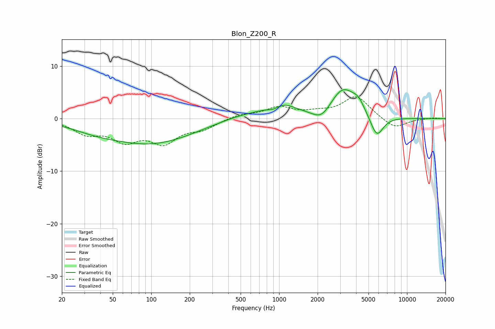

# Blon_Z200_R
See [usage instructions](https://github.com/jaakkopasanen/AutoEq#usage) for more options and info.

### Parametric EQs
Apply preamp of -5.6 dB when using parametric equalizer.

|   # | Type    |   Fc (Hz) |    Q |   Gain (dB) |
|-----|---------|-----------|------|-------------|
|   1 | Peaking |        36 | 0.76 |        -1   |
|   2 | Peaking |       101 | 0.42 |        -4.6 |
|   3 | Peaking |       308 | 0.88 |        -0   |
|   4 | Peaking |       525 | 0.67 |         1.1 |
|   5 | Peaking |       910 | 2.6  |        -1.2 |
|   6 | Peaking |      1019 | 1.29 |         2.8 |
|   7 | Peaking |      2153 | 2.02 |        -2.2 |
|   8 | Peaking |      3158 | 1.36 |         5.8 |
|   9 | Peaking |      4175 | 3.04 |         1.6 |
|  10 | Peaking |      5802 | 2.66 |        -4.3 |

### Fixed Band EQs
When using fixed band (also called graphic) equalizer, apply preamp of **-4.3 dB** (if available) and set gains manually with these parameters.

|   # | Type    |   Fc (Hz) |    Q |   Gain (dB) |
|-----|---------|-----------|------|-------------|
|   1 | Peaking |        31 | 1.41 |        -2.5 |
|   2 | Peaking |        62 | 1.41 |        -3.6 |
|   3 | Peaking |       125 | 1.41 |        -4.1 |
|   4 | Peaking |       250 | 1.41 |        -1.7 |
|   5 | Peaking |       500 | 1.41 |         0.8 |
|   6 | Peaking |      1000 | 1.41 |         2   |
|   7 | Peaking |      2000 | 1.41 |         0.9 |
|   8 | Peaking |      4000 | 1.41 |         4.2 |
|   9 | Peaking |      8000 | 1.41 |        -2   |
|  10 | Peaking |     16000 | 1.41 |         0.2 |

### Graphs

