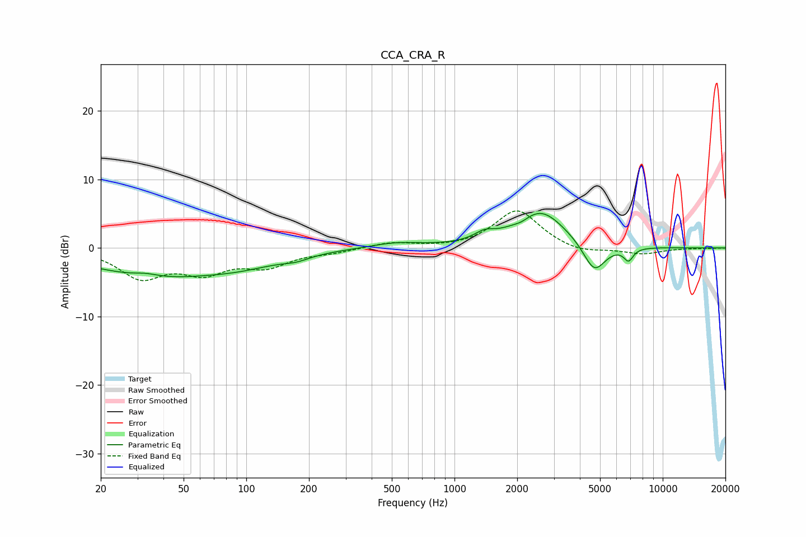

# CCA_CRA_R
See [usage instructions](https://github.com/jaakkopasanen/AutoEq#usage) for more options and info.

### Parametric EQs
Apply preamp of -5.1 dB when using parametric equalizer.

|   # | Type    |   Fc (Hz) |    Q |   Gain (dB) |
|-----|---------|-----------|------|-------------|
|   1 | Peaking |        33 | 2.5  |         0.5 |
|   2 | Peaking |        36 | 0.44 |        -3.9 |
|   3 | Peaking |        97 | 0.71 |        -1.5 |
|   4 | Peaking |       174 | 2.34 |        -0.6 |
|   5 | Peaking |       522 | 1.16 |         0.8 |
|   6 | Peaking |      1391 | 2.93 |         1.1 |
|   7 | Peaking |      2109 | 3.87 |        -0.5 |
|   8 | Peaking |      2582 | 1.15 |         5.5 |
|   9 | Peaking |      4692 | 2.58 |        -4.4 |
|  10 | Peaking |      6850 | 6    |        -1.8 |

### Fixed Band EQs
When using fixed band (also called graphic) equalizer, apply preamp of **-5.5 dB** (if available) and set gains manually with these parameters.

|   # | Type    |   Fc (Hz) |    Q |   Gain (dB) |
|-----|---------|-----------|------|-------------|
|   1 | Peaking |        31 | 1.41 |        -4.1 |
|   2 | Peaking |        62 | 1.41 |        -3.1 |
|   3 | Peaking |       125 | 1.41 |        -2.4 |
|   4 | Peaking |       250 | 1.41 |        -0.5 |
|   5 | Peaking |       500 | 1.41 |         0.8 |
|   6 | Peaking |      1000 | 1.41 |        -0.1 |
|   7 | Peaking |      2000 | 1.41 |         5.6 |
|   8 | Peaking |      4000 | 1.41 |        -0.9 |
|   9 | Peaking |      8000 | 1.41 |        -0.9 |
|  10 | Peaking |     16000 | 1.41 |        -0   |

### Graphs

