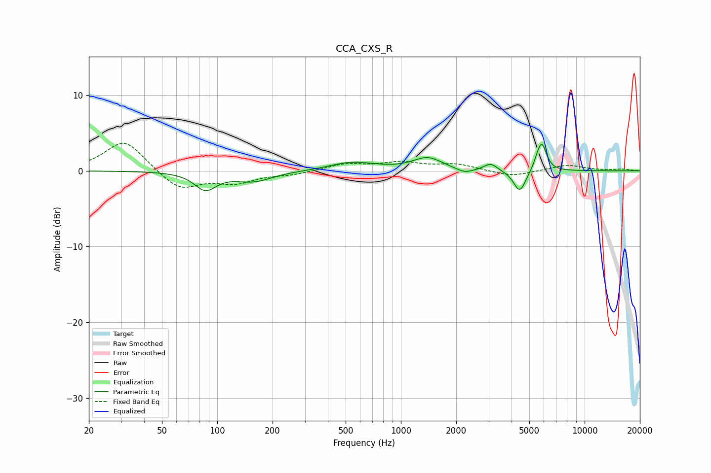

# CCA_CXS_R
See [usage instructions](https://github.com/jaakkopasanen/AutoEq#usage) for more options and info.

### Parametric EQs
Apply preamp of -3.6 dB when using parametric equalizer.

|   # | Type    |   Fc (Hz) |    Q |   Gain (dB) |
|-----|---------|-----------|------|-------------|
|   1 | Peaking |        86 | 2.41 |        -2.3 |
|   2 | Peaking |       157 | 1.37 |        -1.3 |
|   3 | Peaking |       527 | 1.22 |         1   |
|   4 | Peaking |       701 | 1.58 |         0.1 |
|   5 | Peaking |      1396 | 1.76 |         1.7 |
|   6 | Peaking |      2223 | 3.22 |        -0.6 |
|   7 | Peaking |      3080 | 4.02 |         1   |
|   8 | Peaking |      4435 | 4.16 |        -2.9 |
|   9 | Peaking |      5588 | 5.99 |         1.2 |
|  10 | Peaking |      5885 | 5.55 |         3   |

### Fixed Band EQs
When using fixed band (also called graphic) equalizer, apply preamp of **-3.7 dB** (if available) and set gains manually with these parameters.

|   # | Type    |   Fc (Hz) |    Q |   Gain (dB) |
|-----|---------|-----------|------|-------------|
|   1 | Peaking |        31 | 1.41 |         4.1 |
|   2 | Peaking |        62 | 1.41 |        -2.6 |
|   3 | Peaking |       125 | 1.41 |        -1.4 |
|   4 | Peaking |       250 | 1.41 |        -0.4 |
|   5 | Peaking |       500 | 1.41 |         0.9 |
|   6 | Peaking |      1000 | 1.41 |         1   |
|   7 | Peaking |      2000 | 1.41 |         0.8 |
|   8 | Peaking |      4000 | 1.41 |        -0.8 |
|   9 | Peaking |      8000 | 1.41 |         0.8 |
|  10 | Peaking |     16000 | 1.41 |         0.2 |

### Graphs

