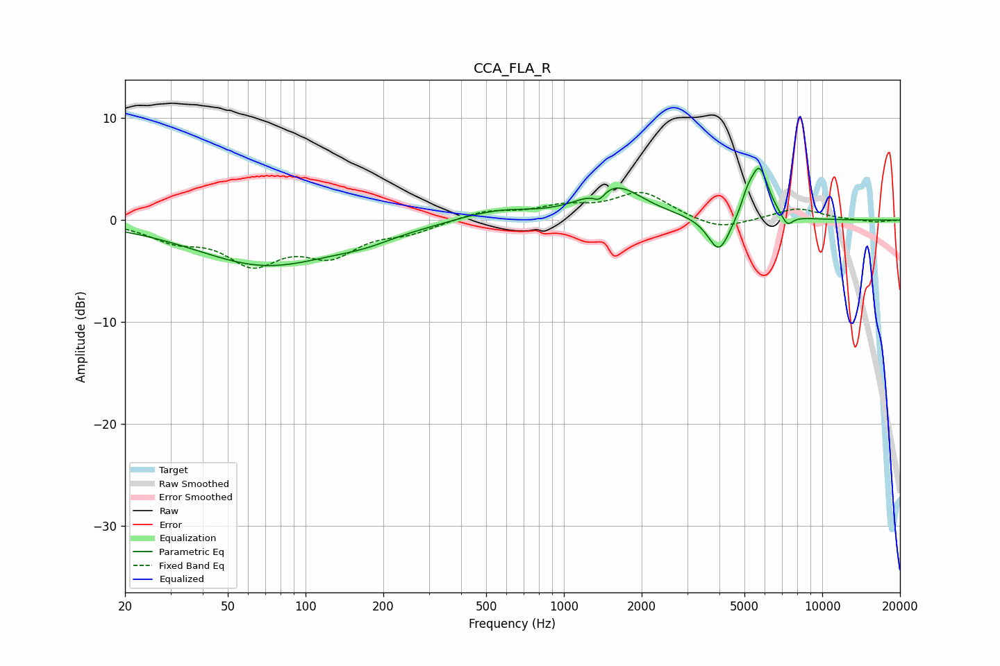

# CCA_FLA_R
See [usage instructions](https://github.com/jaakkopasanen/AutoEq#usage) for more options and info.

### Parametric EQs
Apply preamp of -5.2 dB when using parametric equalizer.

|   # | Type    |   Fc (Hz) |    Q |   Gain (dB) |
|-----|---------|-----------|------|-------------|
|   1 | Peaking |        70 | 0.52 |        -4.3 |
|   2 | Peaking |       170 | 1.13 |        -0.8 |
|   3 | Peaking |       420 | 1.71 |         0.2 |
|   4 | Peaking |       571 | 1.14 |         0.9 |
|   5 | Peaking |      1371 | 6    |        -1   |
|   6 | Peaking |      1563 | 1.29 |         3.3 |
|   7 | Peaking |      3986 | 3.25 |        -3.6 |
|   8 | Peaking |      5120 | 5.99 |         1.3 |
|   9 | Peaking |      5709 | 3.78 |         5.1 |
|  10 | Peaking |      7317 | 5.96 |        -1.2 |

### Fixed Band EQs
When using fixed band (also called graphic) equalizer, apply preamp of **-2.8 dB** (if available) and set gains manually with these parameters.

|   # | Type    |   Fc (Hz) |    Q |   Gain (dB) |
|-----|---------|-----------|------|-------------|
|   1 | Peaking |        31 | 1.41 |        -1.6 |
|   2 | Peaking |        62 | 1.41 |        -3.8 |
|   3 | Peaking |       125 | 1.41 |        -3   |
|   4 | Peaking |       250 | 1.41 |        -1   |
|   5 | Peaking |       500 | 1.41 |         0.9 |
|   6 | Peaking |      1000 | 1.41 |         1.1 |
|   7 | Peaking |      2000 | 1.41 |         2.6 |
|   8 | Peaking |      4000 | 1.41 |        -1.1 |
|   9 | Peaking |      8000 | 1.41 |         1.2 |
|  10 | Peaking |     16000 | 1.41 |        -0.2 |

### Graphs

