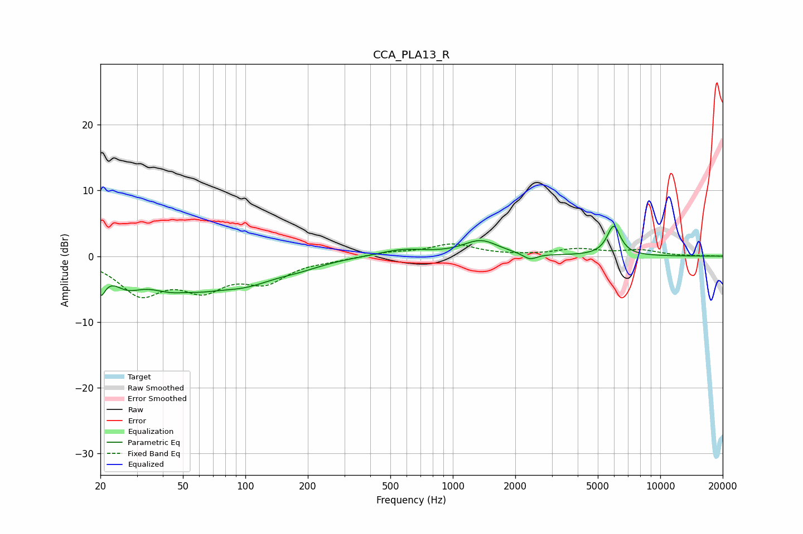

# CCA_PLA13_R
See [usage instructions](https://github.com/jaakkopasanen/AutoEq#usage) for more options and info.

### Parametric EQs
Apply preamp of -4.6 dB when using parametric equalizer.

|   # | Type    |   Fc (Hz) |    Q |   Gain (dB) |
|-----|---------|-----------|------|-------------|
|   1 | Peaking |        20 | 6    |        -3.7 |
|   2 | Peaking |        27 | 2    |        -2.7 |
|   3 | Peaking |        49 | 0.99 |        -5.6 |
|   4 | Peaking |        51 | 1.85 |         1.4 |
|   5 | Peaking |       100 | 0.91 |        -3   |
|   6 | Peaking |       183 | 1.22 |        -0.9 |
|   7 | Peaking |       574 | 1.22 |         1   |
|   8 | Peaking |      1364 | 1.67 |         2.3 |
|   9 | Peaking |      2355 | 4.36 |        -0.9 |
|  10 | Peaking |      5970 | 4.26 |         4.5 |

### Fixed Band EQs
When using fixed band (also called graphic) equalizer, apply preamp of **-2.0 dB** (if available) and set gains manually with these parameters.

|   # | Type    |   Fc (Hz) |    Q |   Gain (dB) |
|-----|---------|-----------|------|-------------|
|   1 | Peaking |        31 | 1.41 |        -5.4 |
|   2 | Peaking |        62 | 1.41 |        -4.3 |
|   3 | Peaking |       125 | 1.41 |        -3.5 |
|   4 | Peaking |       250 | 1.41 |        -0.4 |
|   5 | Peaking |       500 | 1.41 |         0.6 |
|   6 | Peaking |      1000 | 1.41 |         1.8 |
|   7 | Peaking |      2000 | 1.41 |         0   |
|   8 | Peaking |      4000 | 1.41 |         1   |
|   9 | Peaking |      8000 | 1.41 |         0.8 |
|  10 | Peaking |     16000 | 1.41 |         0   |

### Graphs

