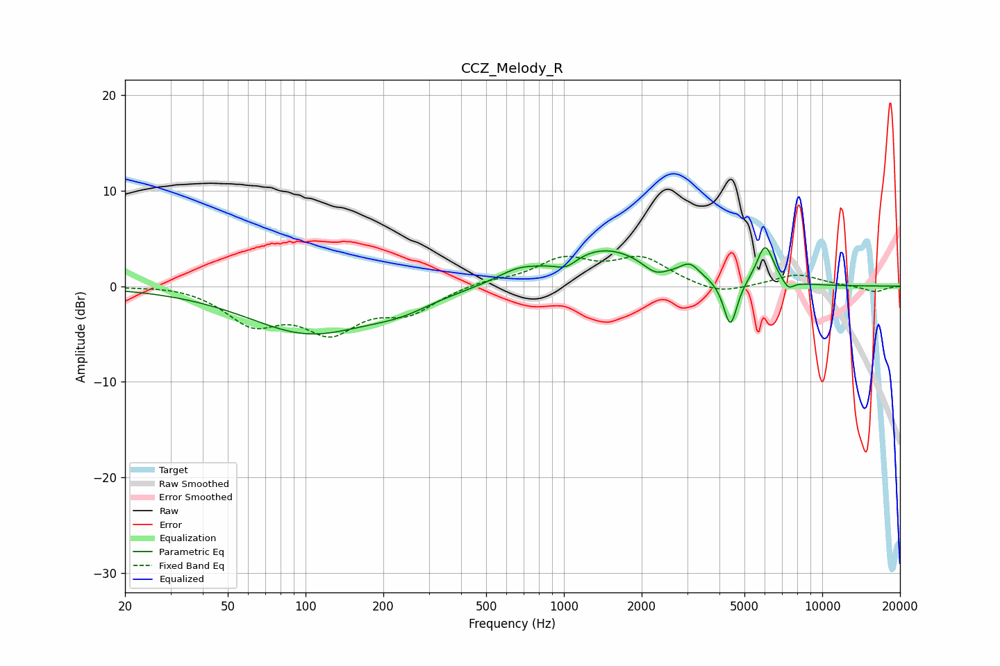

# CCZ_Melody_R
See [usage instructions](https://github.com/jaakkopasanen/AutoEq#usage) for more options and info.

### Parametric EQs
Apply preamp of -4.1 dB when using parametric equalizer.

|   # | Type    |   Fc (Hz) |    Q |   Gain (dB) |
|-----|---------|-----------|------|-------------|
|   1 | Peaking |       103 | 0.59 |        -4.8 |
|   2 | Peaking |       232 | 1.13 |        -1.2 |
|   3 | Peaking |       661 | 1.73 |         1.1 |
|   4 | Peaking |      1020 | 3.29 |        -1   |
|   5 | Peaking |      1435 | 0.79 |         3.9 |
|   6 | Peaking |      2253 | 3.1  |        -1.1 |
|   7 | Peaking |      3073 | 3.84 |         1.3 |
|   8 | Peaking |      4411 | 5.32 |        -5   |
|   9 | Peaking |      6013 | 4.16 |         4.1 |
|  10 | Peaking |      7387 | 5.99 |        -1   |

### Fixed Band EQs
When using fixed band (also called graphic) equalizer, apply preamp of **-3.2 dB** (if available) and set gains manually with these parameters.

|   # | Type    |   Fc (Hz) |    Q |   Gain (dB) |
|-----|---------|-----------|------|-------------|
|   1 | Peaking |        31 | 1.41 |         0.2 |
|   2 | Peaking |        62 | 1.41 |        -3.6 |
|   3 | Peaking |       125 | 1.41 |        -4.3 |
|   4 | Peaking |       250 | 1.41 |        -2.5 |
|   5 | Peaking |       500 | 1.41 |         0.6 |
|   6 | Peaking |      1000 | 1.41 |         2.7 |
|   7 | Peaking |      2000 | 1.41 |         2.8 |
|   8 | Peaking |      4000 | 1.41 |        -1   |
|   9 | Peaking |      8000 | 1.41 |         1.2 |
|  10 | Peaking |     16000 | 1.41 |        -0.6 |

### Graphs

