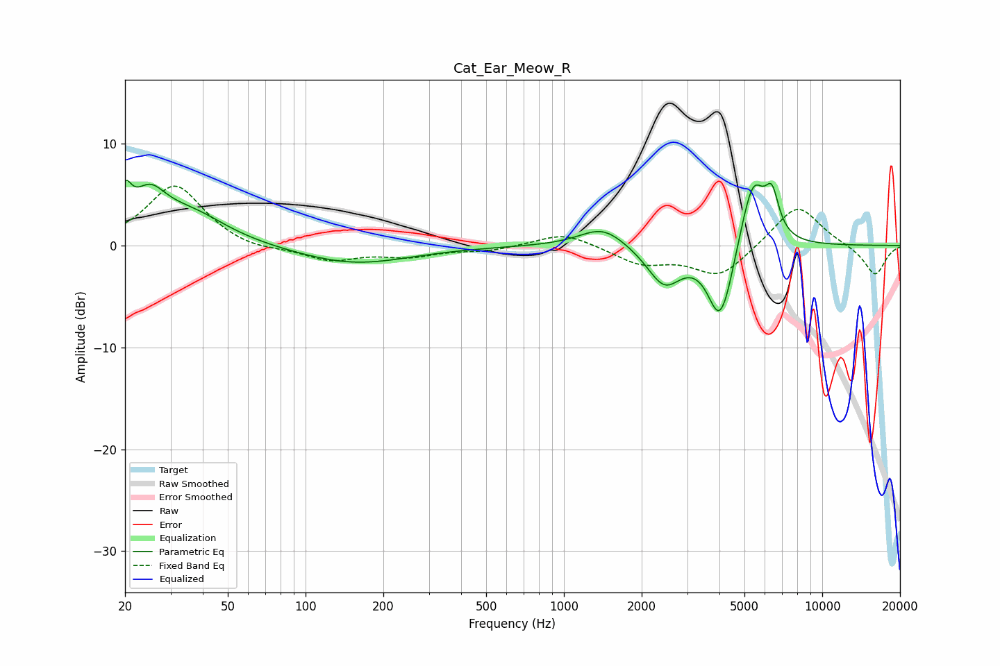

# Cat_Ear_Meow_R
See [usage instructions](https://github.com/jaakkopasanen/AutoEq#usage) for more options and info.

### Parametric EQs
Apply preamp of -6.5 dB when using parametric equalizer.

|   # | Type    |   Fc (Hz) |    Q |   Gain (dB) |
|-----|---------|-----------|------|-------------|
|   1 | Peaking |        20 | 5.81 |         3.2 |
|   2 | Peaking |        25 | 2.18 |         3.8 |
|   3 | Peaking |        36 | 1.01 |         2.9 |
|   4 | Peaking |       154 | 0.65 |        -1.8 |
|   5 | Peaking |      1414 | 1.59 |         2   |
|   6 | Peaking |      2448 | 2.1  |        -3.8 |
|   7 | Peaking |      3992 | 2.96 |        -6.8 |
|   8 | Peaking |      4312 | 4.27 |        -1.1 |
|   9 | Peaking |      5396 | 2.85 |         6.8 |
|  10 | Peaking |      6392 | 5.19 |         3.7 |

### Fixed Band EQs
When using fixed band (also called graphic) equalizer, apply preamp of **-5.9 dB** (if available) and set gains manually with these parameters.

|   # | Type    |   Fc (Hz) |    Q |   Gain (dB) |
|-----|---------|-----------|------|-------------|
|   1 | Peaking |        31 | 1.41 |         6   |
|   2 | Peaking |        62 | 1.41 |        -0.6 |
|   3 | Peaking |       125 | 1.41 |        -1.4 |
|   4 | Peaking |       250 | 1.41 |        -0.9 |
|   5 | Peaking |       500 | 1.41 |        -0.5 |
|   6 | Peaking |      1000 | 1.41 |         1.4 |
|   7 | Peaking |      2000 | 1.41 |        -1.7 |
|   8 | Peaking |      4000 | 1.41 |        -3   |
|   9 | Peaking |      8000 | 1.41 |         4.2 |
|  10 | Peaking |     16000 | 1.41 |        -3   |

### Graphs

