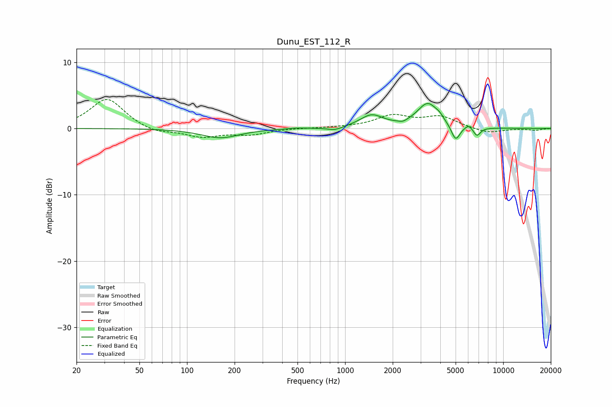

# Dunu_EST_112_R
See [usage instructions](https://github.com/jaakkopasanen/AutoEq#usage) for more options and info.

### Parametric EQs
Apply preamp of -3.9 dB when using parametric equalizer.

|   # | Type    |   Fc (Hz) |    Q |   Gain (dB) |
|-----|---------|-----------|------|-------------|
|   1 | Peaking |       163 | 1.17 |        -1.4 |
|   2 | Peaking |       490 | 2.55 |         0.1 |
|   3 | Peaking |       862 | 2.98 |        -0.5 |
|   4 | Peaking |      1470 | 1.94 |         1.9 |
|   5 | Peaking |      2325 | 5.67 |        -0.3 |
|   6 | Peaking |      3338 | 2.12 |         3.7 |
|   7 | Peaking |      3967 | 6    |         0.4 |
|   8 | Peaking |      5001 | 5.07 |        -2.4 |
|   9 | Peaking |      6053 | 6    |         0.6 |
|  10 | Peaking |      6815 | 6    |        -1.3 |

### Fixed Band EQs
When using fixed band (also called graphic) equalizer, apply preamp of **-4.5 dB** (if available) and set gains manually with these parameters.

|   # | Type    |   Fc (Hz) |    Q |   Gain (dB) |
|-----|---------|-----------|------|-------------|
|   1 | Peaking |        31 | 1.41 |         4.6 |
|   2 | Peaking |        62 | 1.41 |        -0.8 |
|   3 | Peaking |       125 | 1.41 |        -1.2 |
|   4 | Peaking |       250 | 1.41 |        -0.8 |
|   5 | Peaking |       500 | 1.41 |         0   |
|   6 | Peaking |      1000 | 1.41 |         0.1 |
|   7 | Peaking |      2000 | 1.41 |         1.8 |
|   8 | Peaking |      4000 | 1.41 |         1.7 |
|   9 | Peaking |      8000 | 1.41 |        -0.8 |
|  10 | Peaking |     16000 | 1.41 |        -0.3 |

### Graphs

