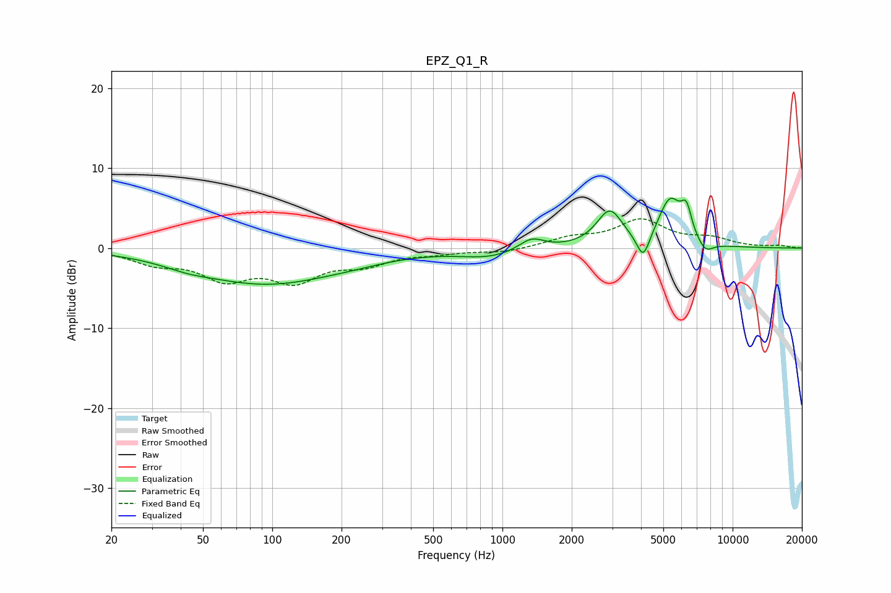

# EPZ_Q1_R
See [usage instructions](https://github.com/jaakkopasanen/AutoEq#usage) for more options and info.

### Parametric EQs
Apply preamp of -6.3 dB when using parametric equalizer.

|   # | Type    |   Fc (Hz) |    Q |   Gain (dB) |
|-----|---------|-----------|------|-------------|
|   1 | Peaking |        43 | 1.4  |        -0.6 |
|   2 | Peaking |        94 | 0.46 |        -4.3 |
|   3 | Peaking |       225 | 0.93 |        -0.4 |
|   4 | Peaking |       885 | 1.1  |        -1.1 |
|   5 | Peaking |      1336 | 2.57 |         1.5 |
|   6 | Peaking |      2924 | 2.52 |         4.5 |
|   7 | Peaking |      4091 | 4.87 |        -3.3 |
|   8 | Peaking |      5348 | 2.67 |         5.8 |
|   9 | Peaking |      6300 | 5.99 |         3.2 |
|  10 | Peaking |      7607 | 3.93 |        -1.4 |

### Fixed Band EQs
When using fixed band (also called graphic) equalizer, apply preamp of **-3.8 dB** (if available) and set gains manually with these parameters.

|   # | Type    |   Fc (Hz) |    Q |   Gain (dB) |
|-----|---------|-----------|------|-------------|
|   1 | Peaking |        31 | 1.41 |        -1.7 |
|   2 | Peaking |        62 | 1.41 |        -3.4 |
|   3 | Peaking |       125 | 1.41 |        -3.6 |
|   4 | Peaking |       250 | 1.41 |        -1.7 |
|   5 | Peaking |       500 | 1.41 |        -0.5 |
|   6 | Peaking |      1000 | 1.41 |        -0.5 |
|   7 | Peaking |      2000 | 1.41 |         1.1 |
|   8 | Peaking |      4000 | 1.41 |         3.3 |
|   9 | Peaking |      8000 | 1.41 |         1   |
|  10 | Peaking |     16000 | 1.41 |         0.3 |

### Graphs

