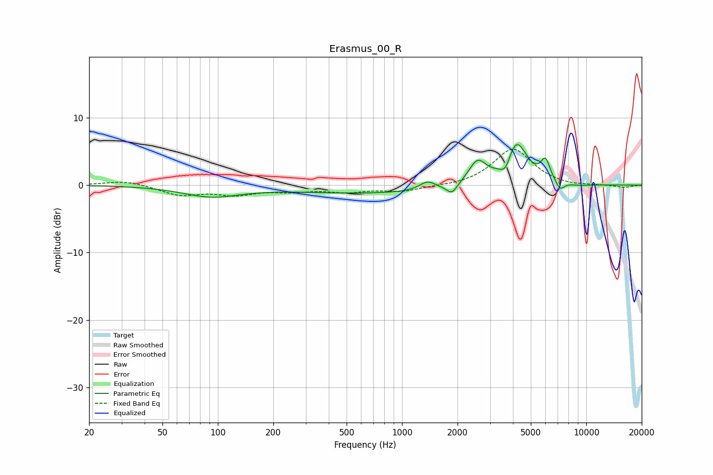

# Erasmus_00_R
See [usage instructions](https://github.com/jaakkopasanen/AutoEq#usage) for more options and info.

### Parametric EQs
Apply preamp of -6.1 dB when using parametric equalizer.

|   # | Type    |   Fc (Hz) |    Q |   Gain (dB) |
|-----|---------|-----------|------|-------------|
|   1 | Peaking |        92 | 0.92 |        -1.6 |
|   2 | Peaking |       727 | 0.29 |        -1.2 |
|   3 | Peaking |      1375 | 3.25 |         1.3 |
|   4 | Peaking |      1866 | 4.86 |        -1.4 |
|   5 | Peaking |      2565 | 2.88 |         3.5 |
|   6 | Peaking |      3652 | 4.72 |        -2.2 |
|   7 | Peaking |      4156 | 2.36 |         6.6 |
|   8 | Peaking |      6006 | 5.52 |         2.9 |
|   9 | Peaking |      7205 | 5.76 |        -1.4 |
|  10 | Peaking |      9227 | 2.1  |        -0.2 |

### Fixed Band EQs
When using fixed band (also called graphic) equalizer, apply preamp of **-5.4 dB** (if available) and set gains manually with these parameters.

|   # | Type    |   Fc (Hz) |    Q |   Gain (dB) |
|-----|---------|-----------|------|-------------|
|   1 | Peaking |        31 | 1.41 |         0.7 |
|   2 | Peaking |        62 | 1.41 |        -1.4 |
|   3 | Peaking |       125 | 1.41 |        -1.2 |
|   4 | Peaking |       250 | 1.41 |        -0.7 |
|   5 | Peaking |       500 | 1.41 |        -0.9 |
|   6 | Peaking |      1000 | 1.41 |        -0.9 |
|   7 | Peaking |      2000 | 1.41 |        -0.2 |
|   8 | Peaking |      4000 | 1.41 |         5.4 |
|   9 | Peaking |      8000 | 1.41 |        -0.3 |
|  10 | Peaking |     16000 | 1.41 |        -0.4 |

### Graphs

