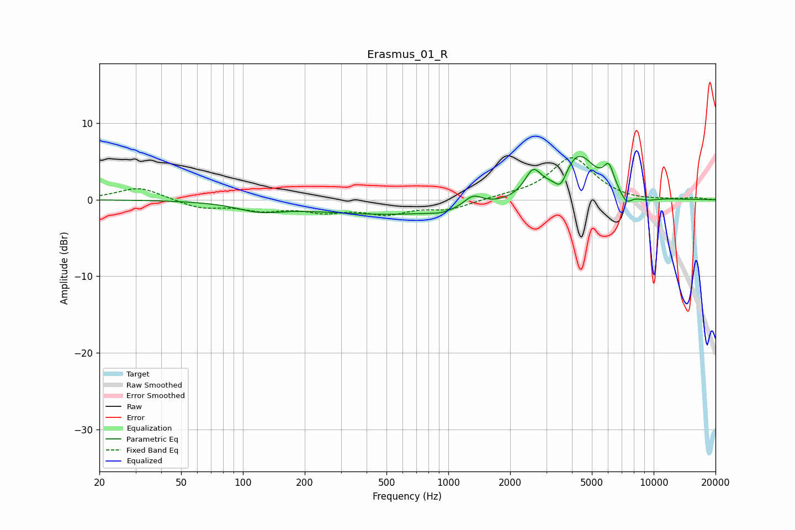

# Erasmus_01_R
See [usage instructions](https://github.com/jaakkopasanen/AutoEq#usage) for more options and info.

### Parametric EQs
Apply preamp of -5.7 dB when using parametric equalizer.

|   # | Type    |   Fc (Hz) |    Q |   Gain (dB) |
|-----|---------|-----------|------|-------------|
|   1 | Peaking |       120 | 1.31 |        -1   |
|   2 | Peaking |       537 | 0.33 |        -1.9 |
|   3 | Peaking |       933 | 2.44 |        -0.4 |
|   4 | Peaking |      1320 | 3.13 |         1.5 |
|   5 | Peaking |      2585 | 3.51 |         3.2 |
|   6 | Peaking |      3531 | 4.73 |        -2.2 |
|   7 | Peaking |      4284 | 1.64 |         6   |
|   8 | Peaking |      6052 | 5.46 |         2.8 |
|   9 | Peaking |      7358 | 4.71 |        -1.4 |
|  10 | Peaking |      9279 | 2.56 |        -0.4 |

### Fixed Band EQs
When using fixed band (also called graphic) equalizer, apply preamp of **-5.6 dB** (if available) and set gains manually with these parameters.

|   # | Type    |   Fc (Hz) |    Q |   Gain (dB) |
|-----|---------|-----------|------|-------------|
|   1 | Peaking |        31 | 1.41 |         1.7 |
|   2 | Peaking |        62 | 1.41 |        -1.1 |
|   3 | Peaking |       125 | 1.41 |        -1.2 |
|   4 | Peaking |       250 | 1.41 |        -1.3 |
|   5 | Peaking |       500 | 1.41 |        -1.6 |
|   6 | Peaking |      1000 | 1.41 |        -1.2 |
|   7 | Peaking |      2000 | 1.41 |         0.3 |
|   8 | Peaking |      4000 | 1.41 |         5.5 |
|   9 | Peaking |      8000 | 1.41 |        -0.2 |
|  10 | Peaking |     16000 | 1.41 |         0.2 |

### Graphs

