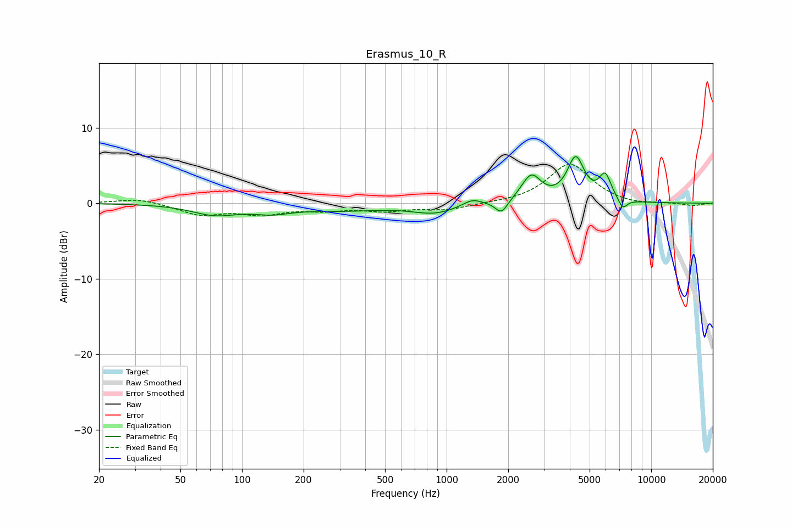

# Erasmus_10_R
See [usage instructions](https://github.com/jaakkopasanen/AutoEq#usage) for more options and info.

### Parametric EQs
Apply preamp of -6.3 dB when using parametric equalizer.

|   # | Type    |   Fc (Hz) |    Q |   Gain (dB) |
|-----|---------|-----------|------|-------------|
|   1 | Peaking |        74 | 1.26 |        -1.4 |
|   2 | Peaking |       140 | 1.55 |        -0.8 |
|   3 | Peaking |       308 | 0.63 |        -0.8 |
|   4 | Peaking |       876 | 1.33 |        -1.2 |
|   5 | Peaking |      1334 | 3.09 |         0.9 |
|   6 | Peaking |      1855 | 4.76 |        -1.7 |
|   7 | Peaking |      2593 | 2.97 |         3.5 |
|   8 | Peaking |      4277 | 3.38 |         5.7 |
|   9 | Peaking |      5957 | 4.59 |         3.3 |
|  10 | Peaking |      7254 | 5.97 |        -1.4 |

### Fixed Band EQs
When using fixed band (also called graphic) equalizer, apply preamp of **-5.2 dB** (if available) and set gains manually with these parameters.

|   # | Type    |   Fc (Hz) |    Q |   Gain (dB) |
|-----|---------|-----------|------|-------------|
|   1 | Peaking |        31 | 1.41 |         0.7 |
|   2 | Peaking |        62 | 1.41 |        -1.5 |
|   3 | Peaking |       125 | 1.41 |        -1.3 |
|   4 | Peaking |       250 | 1.41 |        -0.7 |
|   5 | Peaking |       500 | 1.41 |        -0.9 |
|   6 | Peaking |      1000 | 1.41 |        -0.8 |
|   7 | Peaking |      2000 | 1.41 |        -0   |
|   8 | Peaking |      4000 | 1.41 |         5.2 |
|   9 | Peaking |      8000 | 1.41 |        -0.3 |
|  10 | Peaking |     16000 | 1.41 |        -0.3 |

### Graphs

