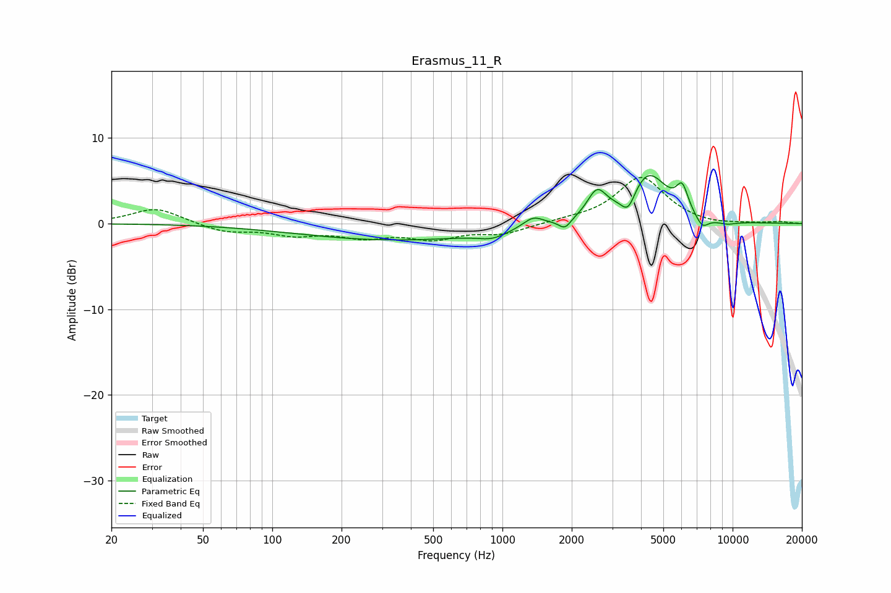

# Erasmus_11_R
See [usage instructions](https://github.com/jaakkopasanen/AutoEq#usage) for more options and info.

### Parametric EQs
Apply preamp of -5.7 dB when using parametric equalizer.

|   # | Type    |   Fc (Hz) |    Q |   Gain (dB) |
|-----|---------|-----------|------|-------------|
|   1 | Peaking |       348 | 0.33 |        -1.9 |
|   2 | Peaking |       902 | 2.34 |        -0.7 |
|   3 | Peaking |      1360 | 3.13 |         1.2 |
|   4 | Peaking |      1869 | 5.54 |        -1.1 |
|   5 | Peaking |      2573 | 3.39 |         3.1 |
|   6 | Peaking |      3518 | 4.59 |        -2.3 |
|   7 | Peaking |      4297 | 1.65 |         5.8 |
|   8 | Peaking |      6039 | 5.49 |         2.8 |
|   9 | Peaking |      7375 | 4.71 |        -1.4 |
|  10 | Peaking |      9405 | 2.56 |        -0.4 |

### Fixed Band EQs
When using fixed band (also called graphic) equalizer, apply preamp of **-5.5 dB** (if available) and set gains manually with these parameters.

|   # | Type    |   Fc (Hz) |    Q |   Gain (dB) |
|-----|---------|-----------|------|-------------|
|   1 | Peaking |        31 | 1.41 |         1.8 |
|   2 | Peaking |        62 | 1.41 |        -1   |
|   3 | Peaking |       125 | 1.41 |        -1.2 |
|   4 | Peaking |       250 | 1.41 |        -1.4 |
|   5 | Peaking |       500 | 1.41 |        -1.6 |
|   6 | Peaking |      1000 | 1.41 |        -1.1 |
|   7 | Peaking |      2000 | 1.41 |         0.3 |
|   8 | Peaking |      4000 | 1.41 |         5.4 |
|   9 | Peaking |      8000 | 1.41 |        -0.3 |
|  10 | Peaking |     16000 | 1.41 |         0.2 |

### Graphs

