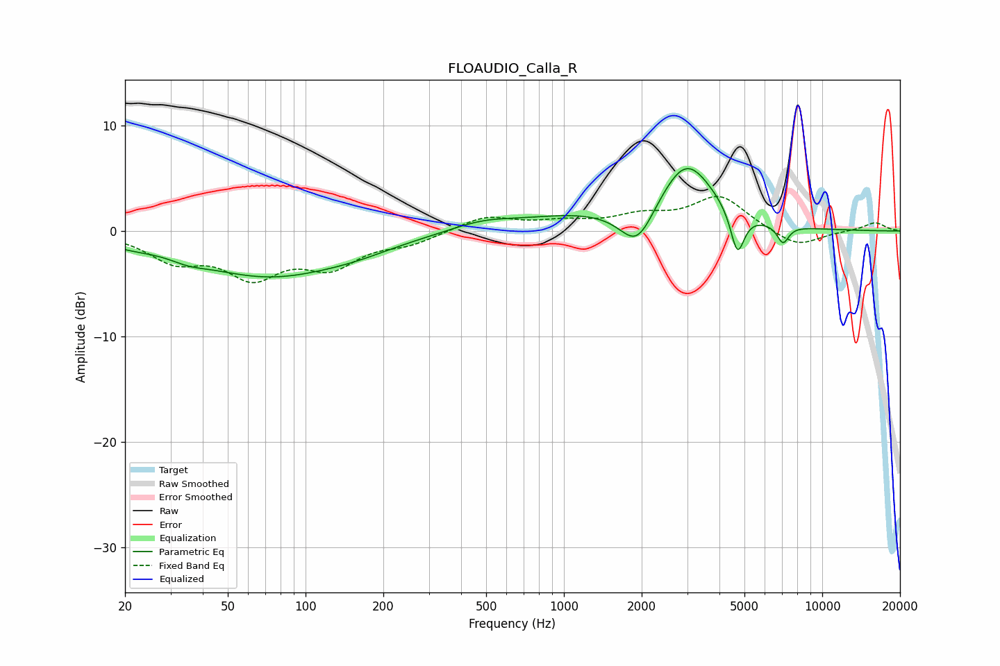

# FLOAUDIO_Calla_R
See [usage instructions](https://github.com/jaakkopasanen/AutoEq#usage) for more options and info.

### Parametric EQs
Apply preamp of -6.0 dB when using parametric equalizer.

|   # | Type    |   Fc (Hz) |    Q |   Gain (dB) |
|-----|---------|-----------|------|-------------|
|   1 | Peaking |        21 | 1.52 |        -0.5 |
|   2 | Peaking |        35 | 2.08 |        -0.5 |
|   3 | Peaking |        72 | 0.49 |        -4.2 |
|   4 | Peaking |       159 | 0.96 |        -0.6 |
|   5 | Peaking |       485 | 1.13 |         0.8 |
|   6 | Peaking |      1118 | 0.63 |         1.3 |
|   7 | Peaking |      1923 | 2.12 |        -3.9 |
|   8 | Peaking |      2979 | 1.3  |         6.5 |
|   9 | Peaking |      4697 | 5.29 |        -4.1 |
|  10 | Peaking |      7046 | 6    |        -1.7 |

### Fixed Band EQs
When using fixed band (also called graphic) equalizer, apply preamp of **-3.4 dB** (if available) and set gains manually with these parameters.

|   # | Type    |   Fc (Hz) |    Q |   Gain (dB) |
|-----|---------|-----------|------|-------------|
|   1 | Peaking |        31 | 1.41 |        -2.5 |
|   2 | Peaking |        62 | 1.41 |        -3.9 |
|   3 | Peaking |       125 | 1.41 |        -3   |
|   4 | Peaking |       250 | 1.41 |        -1   |
|   5 | Peaking |       500 | 1.41 |         1.4 |
|   6 | Peaking |      1000 | 1.41 |         0.7 |
|   7 | Peaking |      2000 | 1.41 |         1.2 |
|   8 | Peaking |      4000 | 1.41 |         3.2 |
|   9 | Peaking |      8000 | 1.41 |        -1.6 |
|  10 | Peaking |     16000 | 1.41 |         0.8 |

### Graphs

