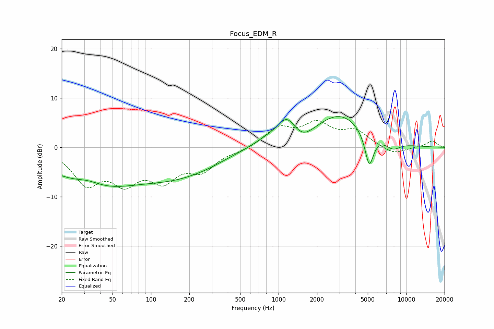

# Focus_EDM_R
See [usage instructions](https://github.com/jaakkopasanen/AutoEq#usage) for more options and info.

### Parametric EQs
Apply preamp of -6.3 dB when using parametric equalizer.

|   # | Type    |   Fc (Hz) |    Q |   Gain (dB) |
|-----|---------|-----------|------|-------------|
|   1 | Peaking |        32 | 1.36 |         1.4 |
|   2 | Peaking |        36 | 0.4  |        -7.6 |
|   3 | Peaking |       170 | 0.5  |        -4.5 |
|   4 | Peaking |       287 | 1.25 |        -0.4 |
|   5 | Peaking |       876 | 1.08 |         1.7 |
|   6 | Peaking |      1159 | 2.16 |         3.8 |
|   7 | Peaking |      1560 | 1.88 |        -1.8 |
|   8 | Peaking |      3037 | 0.71 |         6.6 |
|   9 | Peaking |      5136 | 3.97 |        -6.9 |
|  10 | Peaking |      7876 | 2.36 |        -1.6 |

### Fixed Band EQs
When using fixed band (also called graphic) equalizer, apply preamp of **-5.5 dB** (if available) and set gains manually with these parameters.

|   # | Type    |   Fc (Hz) |    Q |   Gain (dB) |
|-----|---------|-----------|------|-------------|
|   1 | Peaking |        31 | 1.41 |        -6.8 |
|   2 | Peaking |        62 | 1.41 |        -6   |
|   3 | Peaking |       125 | 1.41 |        -5.7 |
|   4 | Peaking |       250 | 1.41 |        -4.1 |
|   5 | Peaking |       500 | 1.41 |        -0.6 |
|   6 | Peaking |      1000 | 1.41 |         3.7 |
|   7 | Peaking |      2000 | 1.41 |         4.3 |
|   8 | Peaking |      4000 | 1.41 |         3   |
|   9 | Peaking |      8000 | 1.41 |        -1.5 |
|  10 | Peaking |     16000 | 1.41 |         1.3 |

### Graphs

