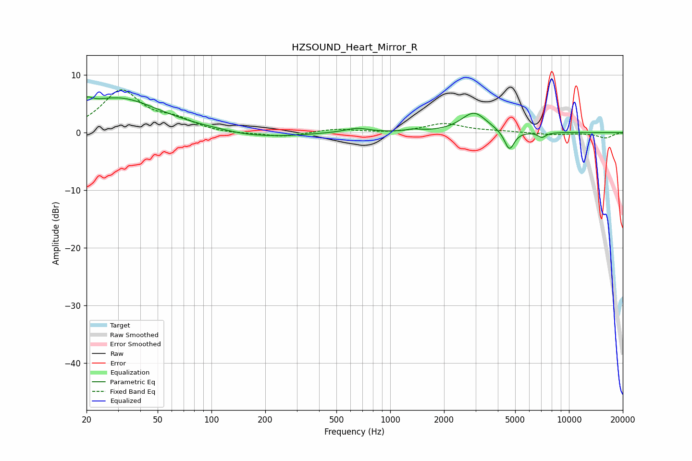

# HZSOUND_Heart_Mirror_R
See [usage instructions](https://github.com/jaakkopasanen/AutoEq#usage) for more options and info.

### Parametric EQs
Apply preamp of -6.3 dB when using parametric equalizer.

|   # | Type    |   Fc (Hz) |    Q |   Gain (dB) |
|-----|---------|-----------|------|-------------|
|   1 | Peaking |        20 | 4.64 |         1.4 |
|   2 | Peaking |        30 | 0.61 |         6   |
|   3 | Peaking |       155 | 1.22 |        -0.5 |
|   4 | Peaking |       244 | 0.92 |        -0.6 |
|   5 | Peaking |       652 | 2.16 |         0.8 |
|   6 | Peaking |      1345 | 3.69 |         0.4 |
|   7 | Peaking |      2942 | 2    |         3.5 |
|   8 | Peaking |      4640 | 5.07 |        -3.4 |
|   9 | Peaking |      7062 | 6    |        -0.9 |
|  10 | Peaking |      9963 | 6    |         0   |

### Fixed Band EQs
When using fixed band (also called graphic) equalizer, apply preamp of **-7.5 dB** (if available) and set gains manually with these parameters.

|   # | Type    |   Fc (Hz) |    Q |   Gain (dB) |
|-----|---------|-----------|------|-------------|
|   1 | Peaking |        31 | 1.41 |         7.1 |
|   2 | Peaking |        62 | 1.41 |         1.8 |
|   3 | Peaking |       125 | 1.41 |        -0.3 |
|   4 | Peaking |       250 | 1.41 |        -0.8 |
|   5 | Peaking |       500 | 1.41 |         0.6 |
|   6 | Peaking |      1000 | 1.41 |        -0.1 |
|   7 | Peaking |      2000 | 1.41 |         1.6 |
|   8 | Peaking |      4000 | 1.41 |         0.2 |
|   9 | Peaking |      8000 | 1.41 |        -0.4 |
|  10 | Peaking |     16000 | 1.41 |        -0.9 |

### Graphs

