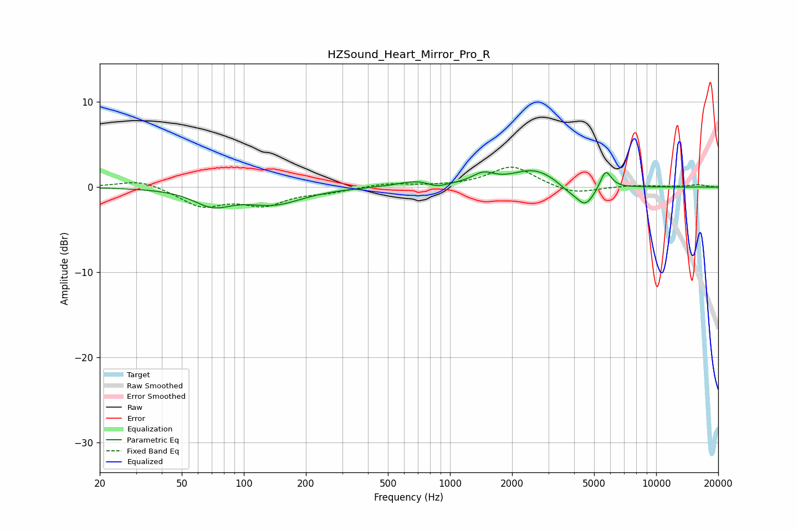

# HZSound_Heart_Mirror_Pro_R
See [usage instructions](https://github.com/jaakkopasanen/AutoEq#usage) for more options and info.

### Parametric EQs
Apply preamp of -2.0 dB when using parametric equalizer.

|   # | Type    |   Fc (Hz) |    Q |   Gain (dB) |
|-----|---------|-----------|------|-------------|
|   1 | Peaking |        71 | 1.55 |        -1.9 |
|   2 | Peaking |       140 | 1.03 |        -1.9 |
|   3 | Peaking |       676 | 1.89 |         0.3 |
|   4 | Peaking |       749 | 1.27 |         0.5 |
|   5 | Peaking |       865 | 2.9  |        -0.6 |
|   6 | Peaking |      1447 | 2.67 |         1.2 |
|   7 | Peaking |      2557 | 1.31 |         2   |
|   8 | Peaking |      3681 | 3.26 |        -0.5 |
|   9 | Peaking |      4521 | 2.85 |        -2.5 |
|  10 | Peaking |      5691 | 5.08 |         2.3 |

### Fixed Band EQs
When using fixed band (also called graphic) equalizer, apply preamp of **-2.4 dB** (if available) and set gains manually with these parameters.

|   # | Type    |   Fc (Hz) |    Q |   Gain (dB) |
|-----|---------|-----------|------|-------------|
|   1 | Peaking |        31 | 1.41 |         0.9 |
|   2 | Peaking |        62 | 1.41 |        -2.2 |
|   3 | Peaking |       125 | 1.41 |        -1.9 |
|   4 | Peaking |       250 | 1.41 |        -0.5 |
|   5 | Peaking |       500 | 1.41 |         0.4 |
|   6 | Peaking |      1000 | 1.41 |         0.1 |
|   7 | Peaking |      2000 | 1.41 |         2.5 |
|   8 | Peaking |      4000 | 1.41 |        -0.9 |
|   9 | Peaking |      8000 | 1.41 |         0.2 |
|  10 | Peaking |     16000 | 1.41 |         0.3 |

### Graphs

