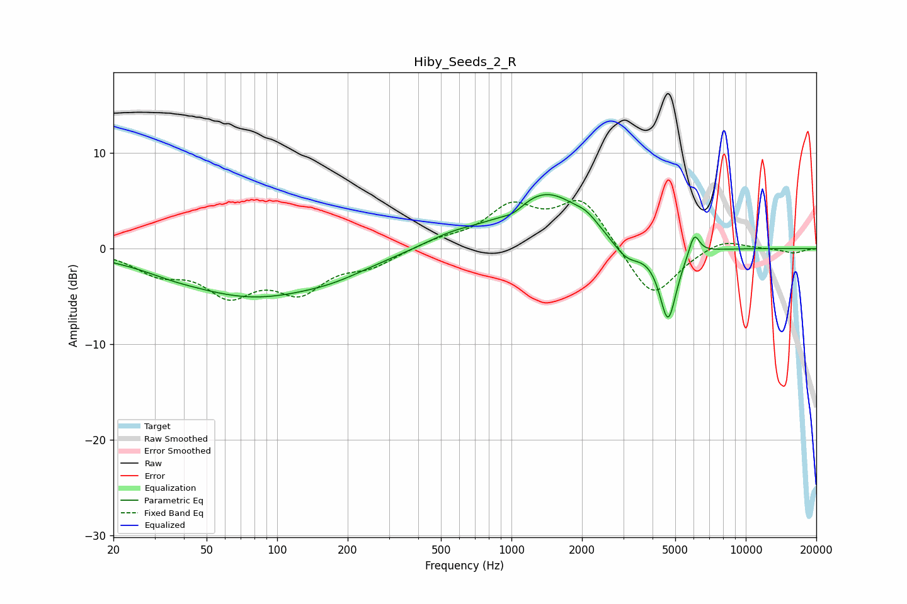

# Hiby_Seeds_2_R
See [usage instructions](https://github.com/jaakkopasanen/AutoEq#usage) for more options and info.

### Parametric EQs
Apply preamp of -5.8 dB when using parametric equalizer.

|   # | Type    |   Fc (Hz) |    Q |   Gain (dB) |
|-----|---------|-----------|------|-------------|
|   1 | Peaking |        35 | 1.41 |        -0.3 |
|   2 | Peaking |        79 | 0.43 |        -4.9 |
|   3 | Peaking |       178 | 0.99 |        -0.7 |
|   4 | Peaking |       555 | 1.14 |         1   |
|   5 | Peaking |      1018 | 3.06 |        -0.8 |
|   6 | Peaking |      1404 | 0.85 |         5.9 |
|   7 | Peaking |      2094 | 3.21 |         0.7 |
|   8 | Peaking |      3101 | 2.22 |        -2.1 |
|   9 | Peaking |      4659 | 3.75 |        -7.7 |
|  10 | Peaking |      6024 | 6    |         2.4 |

### Fixed Band EQs
When using fixed band (also called graphic) equalizer, apply preamp of **-5.1 dB** (if available) and set gains manually with these parameters.

|   # | Type    |   Fc (Hz) |    Q |   Gain (dB) |
|-----|---------|-----------|------|-------------|
|   1 | Peaking |        31 | 1.41 |        -2.2 |
|   2 | Peaking |        62 | 1.41 |        -4.2 |
|   3 | Peaking |       125 | 1.41 |        -4   |
|   4 | Peaking |       250 | 1.41 |        -1.6 |
|   5 | Peaking |       500 | 1.41 |         0.8 |
|   6 | Peaking |      1000 | 1.41 |         4   |
|   7 | Peaking |      2000 | 1.41 |         5.1 |
|   8 | Peaking |      4000 | 1.41 |        -5.5 |
|   9 | Peaking |      8000 | 1.41 |         1.2 |
|  10 | Peaking |     16000 | 1.41 |        -0.5 |

### Graphs

