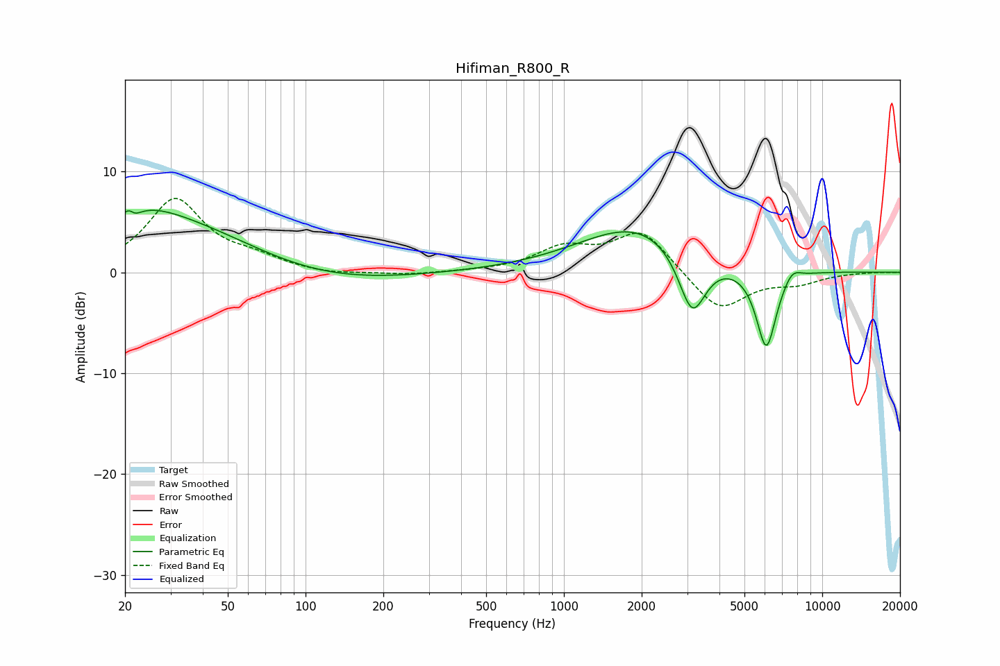

# Hifiman_R800_R
See [usage instructions](https://github.com/jaakkopasanen/AutoEq#usage) for more options and info.

### Parametric EQs
Apply preamp of -6.2 dB when using parametric equalizer.

|   # | Type    |   Fc (Hz) |    Q |   Gain (dB) |
|-----|---------|-----------|------|-------------|
|   1 | Peaking |        21 | 5.9  |         3.2 |
|   2 | Peaking |        21 | 5.92 |        -3.1 |
|   3 | Peaking |        24 | 1.04 |         1.8 |
|   4 | Peaking |        32 | 0.4  |         5.1 |
|   5 | Peaking |        99 | 0.44 |        -1.8 |
|   6 | Peaking |      1961 | 0.62 |         4.8 |
|   7 | Peaking |      2610 | 2.18 |         0   |
|   8 | Peaking |      3138 | 2.58 |        -6.6 |
|   9 | Peaking |      6075 | 3.44 |        -8.1 |
|  10 | Peaking |      7638 | 3.98 |         1.1 |

### Fixed Band EQs
When using fixed band (also called graphic) equalizer, apply preamp of **-7.4 dB** (if available) and set gains manually with these parameters.

|   # | Type    |   Fc (Hz) |    Q |   Gain (dB) |
|-----|---------|-----------|------|-------------|
|   1 | Peaking |        31 | 1.41 |         7.1 |
|   2 | Peaking |        62 | 1.41 |         1.1 |
|   3 | Peaking |       125 | 1.41 |        -0.3 |
|   4 | Peaking |       250 | 1.41 |        -0.3 |
|   5 | Peaking |       500 | 1.41 |         0   |
|   6 | Peaking |      1000 | 1.41 |         2.2 |
|   7 | Peaking |      2000 | 1.41 |         4.1 |
|   8 | Peaking |      4000 | 1.41 |        -3.9 |
|   9 | Peaking |      8000 | 1.41 |        -0.9 |
|  10 | Peaking |     16000 | 1.41 |         0   |

### Graphs

