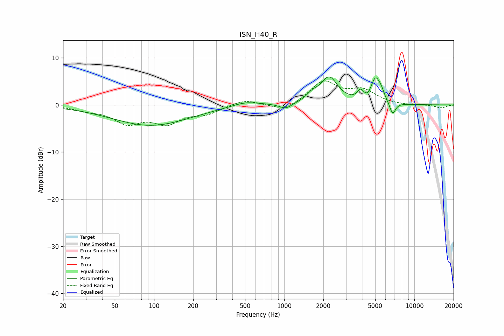

# ISN_H40_R
See [usage instructions](https://github.com/jaakkopasanen/AutoEq#usage) for more options and info.

### Parametric EQs
Apply preamp of -6.0 dB when using parametric equalizer.

|   # | Type    |   Fc (Hz) |    Q |   Gain (dB) |
|-----|---------|-----------|------|-------------|
|   1 | Peaking |        94 | 0.47 |        -4.4 |
|   2 | Peaking |       506 | 1.3  |         1   |
|   3 | Peaking |      1028 | 2.98 |        -1.2 |
|   4 | Peaking |      1636 | 3.24 |         1.2 |
|   5 | Peaking |      2212 | 2.11 |         5.6 |
|   6 | Peaking |      3853 | 5.83 |         1.8 |
|   7 | Peaking |      4392 | 5.92 |        -0.7 |
|   8 | Peaking |      5029 | 3.74 |         5.2 |
|   9 | Peaking |      5573 | 5.89 |         1.2 |
|  10 | Peaking |      6798 | 5.93 |        -2.7 |

### Fixed Band EQs
When using fixed band (also called graphic) equalizer, apply preamp of **-5.2 dB** (if available) and set gains manually with these parameters.

|   # | Type    |   Fc (Hz) |    Q |   Gain (dB) |
|-----|---------|-----------|------|-------------|
|   1 | Peaking |        31 | 1.41 |        -0.9 |
|   2 | Peaking |        62 | 1.41 |        -3.5 |
|   3 | Peaking |       125 | 1.41 |        -3.5 |
|   4 | Peaking |       250 | 1.41 |        -1.7 |
|   5 | Peaking |       500 | 1.41 |         1.2 |
|   6 | Peaking |      1000 | 1.41 |        -1.5 |
|   7 | Peaking |      2000 | 1.41 |         4.8 |
|   8 | Peaking |      4000 | 1.41 |         2.8 |
|   9 | Peaking |      8000 | 1.41 |        -0.1 |
|  10 | Peaking |     16000 | 1.41 |        -0.6 |

### Graphs

