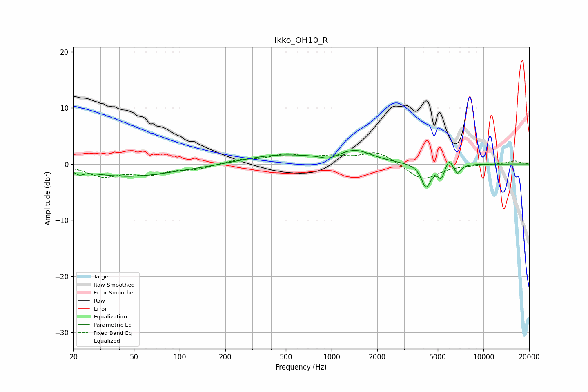

# Ikko_OH10_R
See [usage instructions](https://github.com/jaakkopasanen/AutoEq#usage) for more options and info.

### Parametric EQs
Apply preamp of -2.5 dB when using parametric equalizer.

|   # | Type    |   Fc (Hz) |    Q |   Gain (dB) |
|-----|---------|-----------|------|-------------|
|   1 | Peaking |        22 | 5.59 |        -0.7 |
|   2 | Peaking |        45 | 0.56 |        -1.5 |
|   3 | Peaking |        84 | 0.24 |        -0.8 |
|   4 | Peaking |       430 | 0.52 |         1.9 |
|   5 | Peaking |       958 | 2.88 |        -0.7 |
|   6 | Peaking |      1442 | 1.32 |         2.1 |
|   7 | Peaking |      4192 | 4.48 |        -4.1 |
|   8 | Peaking |      5273 | 6    |        -2.3 |
|   9 | Peaking |      5931 | 5.99 |         1.6 |
|  10 | Peaking |      6740 | 6    |        -1.7 |

### Fixed Band EQs
When using fixed band (also called graphic) equalizer, apply preamp of **-2.1 dB** (if available) and set gains manually with these parameters.

|   # | Type    |   Fc (Hz) |    Q |   Gain (dB) |
|-----|---------|-----------|------|-------------|
|   1 | Peaking |        31 | 1.41 |        -2.1 |
|   2 | Peaking |        62 | 1.41 |        -1.6 |
|   3 | Peaking |       125 | 1.41 |        -0.8 |
|   4 | Peaking |       250 | 1.41 |         0.7 |
|   5 | Peaking |       500 | 1.41 |         1.5 |
|   6 | Peaking |      1000 | 1.41 |         1   |
|   7 | Peaking |      2000 | 1.41 |         2.2 |
|   8 | Peaking |      4000 | 1.41 |        -2.9 |
|   9 | Peaking |      8000 | 1.41 |        -0.1 |
|  10 | Peaking |     16000 | 1.41 |         0.6 |

### Graphs

