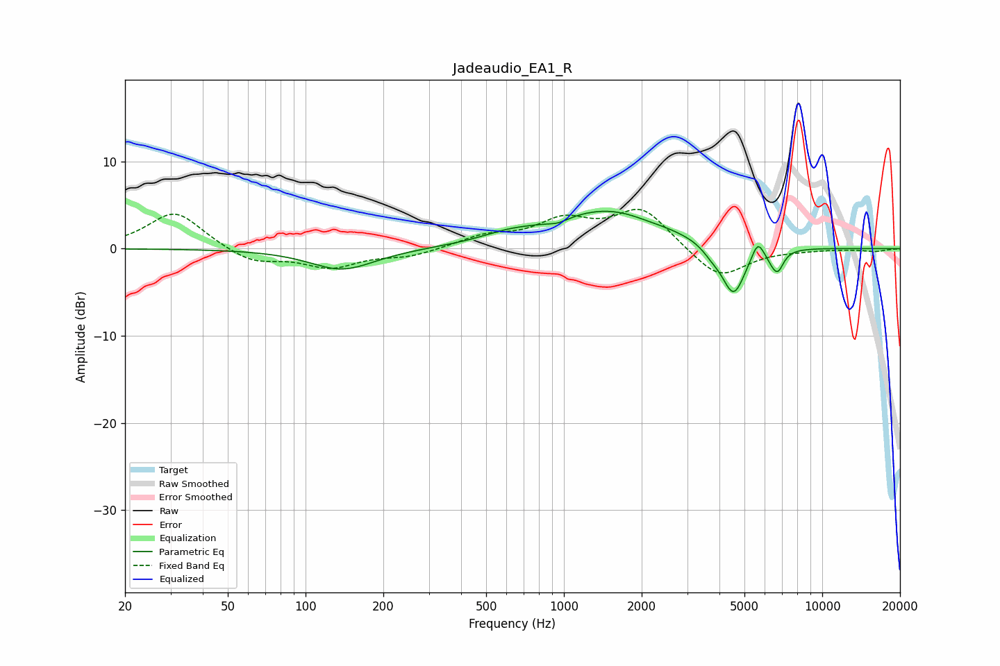

# Jadeaudio_EA1_R
See [usage instructions](https://github.com/jaakkopasanen/AutoEq#usage) for more options and info.

### Parametric EQs
Apply preamp of -4.4 dB when using parametric equalizer.

|   # | Type    |   Fc (Hz) |    Q |   Gain (dB) |
|-----|---------|-----------|------|-------------|
|   1 | Peaking |       139 | 1.13 |        -2.4 |
|   2 | Peaking |       605 | 1.33 |         0.8 |
|   3 | Peaking |       946 | 3.5  |        -0.5 |
|   4 | Peaking |      1481 | 0.64 |         4.4 |
|   5 | Peaking |      2103 | 2.08 |        -0.2 |
|   6 | Peaking |      3747 | 3.72 |        -0.8 |
|   7 | Peaking |      4536 | 3.05 |        -5.8 |
|   8 | Peaking |      5629 | 5.99 |         2   |
|   9 | Peaking |      6359 | 6    |        -0.7 |
|  10 | Peaking |      6732 | 6    |        -2.2 |

### Fixed Band EQs
When using fixed band (also called graphic) equalizer, apply preamp of **-4.6 dB** (if available) and set gains manually with these parameters.

|   # | Type    |   Fc (Hz) |    Q |   Gain (dB) |
|-----|---------|-----------|------|-------------|
|   1 | Peaking |        31 | 1.41 |         4.3 |
|   2 | Peaking |        62 | 1.41 |        -1.7 |
|   3 | Peaking |       125 | 1.41 |        -2   |
|   4 | Peaking |       250 | 1.41 |        -0.8 |
|   5 | Peaking |       500 | 1.41 |         1.3 |
|   6 | Peaking |      1000 | 1.41 |         2.9 |
|   7 | Peaking |      2000 | 1.41 |         4.5 |
|   8 | Peaking |      4000 | 1.41 |        -3.6 |
|   9 | Peaking |      8000 | 1.41 |        -0.1 |
|  10 | Peaking |     16000 | 1.41 |        -0.3 |

### Graphs

