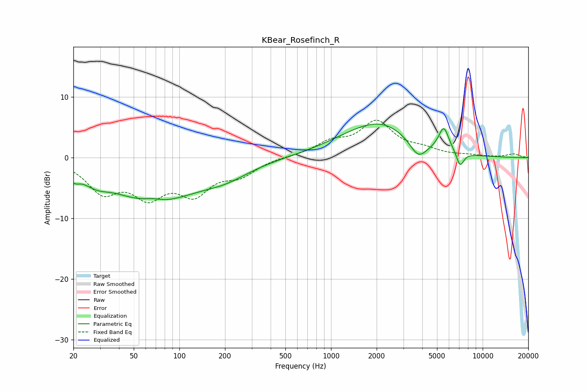

# KBear_Rosefinch_R
See [usage instructions](https://github.com/jaakkopasanen/AutoEq#usage) for more options and info.

### Parametric EQs
Apply preamp of -5.6 dB when using parametric equalizer.

|   # | Type    |   Fc (Hz) |    Q |   Gain (dB) |
|-----|---------|-----------|------|-------------|
|   1 | Peaking |        20 | 4.45 |        -1.3 |
|   2 | Peaking |        28 | 1.67 |        -1.7 |
|   3 | Peaking |        66 | 2.12 |         0.8 |
|   4 | Peaking |        67 | 0.51 |        -7.1 |
|   5 | Peaking |       201 | 0.85 |        -2   |
|   6 | Peaking |      1395 | 0.62 |         1.8 |
|   7 | Peaking |      2219 | 0.72 |         4.4 |
|   8 | Peaking |      3761 | 2.54 |        -2.8 |
|   9 | Peaking |      5544 | 3.99 |         4   |
|  10 | Peaking |      7104 | 5.52 |        -2.4 |

### Fixed Band EQs
When using fixed band (also called graphic) equalizer, apply preamp of **-6.3 dB** (if available) and set gains manually with these parameters.

|   # | Type    |   Fc (Hz) |    Q |   Gain (dB) |
|-----|---------|-----------|------|-------------|
|   1 | Peaking |        31 | 1.41 |        -5.1 |
|   2 | Peaking |        62 | 1.41 |        -5.4 |
|   3 | Peaking |       125 | 1.41 |        -5.2 |
|   4 | Peaking |       250 | 1.41 |        -2.5 |
|   5 | Peaking |       500 | 1.41 |         0.2 |
|   6 | Peaking |      1000 | 1.41 |         2.2 |
|   7 | Peaking |      2000 | 1.41 |         5.6 |
|   8 | Peaking |      4000 | 1.41 |         1.1 |
|   9 | Peaking |      8000 | 1.41 |         0.3 |
|  10 | Peaking |     16000 | 1.41 |         0.6 |

### Graphs

