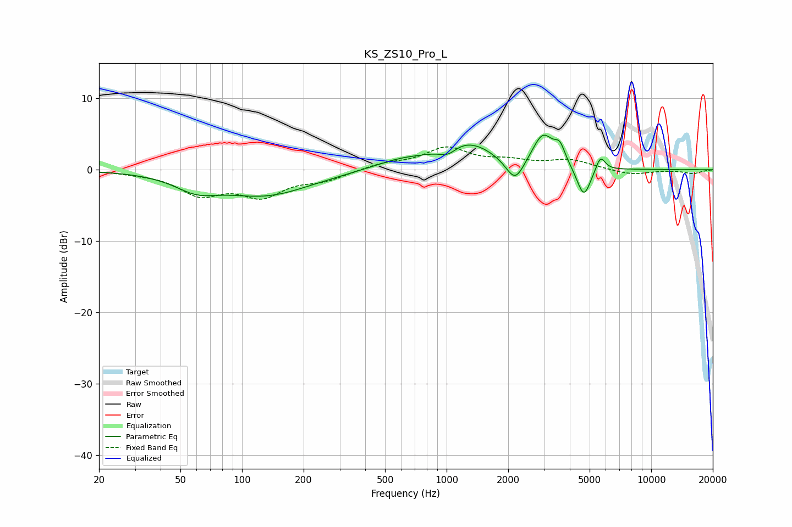

# KS_ZS10_Pro_L
See [usage instructions](https://github.com/jaakkopasanen/AutoEq#usage) for more options and info.

### Parametric EQs
Apply preamp of -4.9 dB when using parametric equalizer.

|   # | Type    |   Fc (Hz) |    Q |   Gain (dB) |
|-----|---------|-----------|------|-------------|
|   1 | Peaking |        60 | 1.35 |        -2   |
|   2 | Peaking |       131 | 0.64 |        -3.5 |
|   3 | Peaking |       596 | 1.03 |         1.2 |
|   4 | Peaking |      1015 | 3.37 |        -1.1 |
|   5 | Peaking |      1264 | 1.05 |         3.7 |
|   6 | Peaking |      2162 | 3.13 |        -3.5 |
|   7 | Peaking |      2961 | 2.69 |         4.6 |
|   8 | Peaking |      3579 | 5.49 |         2.2 |
|   9 | Peaking |      4684 | 4.11 |        -4.4 |
|  10 | Peaking |      5646 | 6    |         2.2 |

### Fixed Band EQs
When using fixed band (also called graphic) equalizer, apply preamp of **-3.3 dB** (if available) and set gains manually with these parameters.

|   # | Type    |   Fc (Hz) |    Q |   Gain (dB) |
|-----|---------|-----------|------|-------------|
|   1 | Peaking |        31 | 1.41 |        -0.3 |
|   2 | Peaking |        62 | 1.41 |        -3.2 |
|   3 | Peaking |       125 | 1.41 |        -3.4 |
|   4 | Peaking |       250 | 1.41 |        -1.3 |
|   5 | Peaking |       500 | 1.41 |         0.8 |
|   6 | Peaking |      1000 | 1.41 |         2.9 |
|   7 | Peaking |      2000 | 1.41 |         1   |
|   8 | Peaking |      4000 | 1.41 |         1.3 |
|   9 | Peaking |      8000 | 1.41 |        -0.7 |
|  10 | Peaking |     16000 | 1.41 |        -0.5 |

### Graphs

