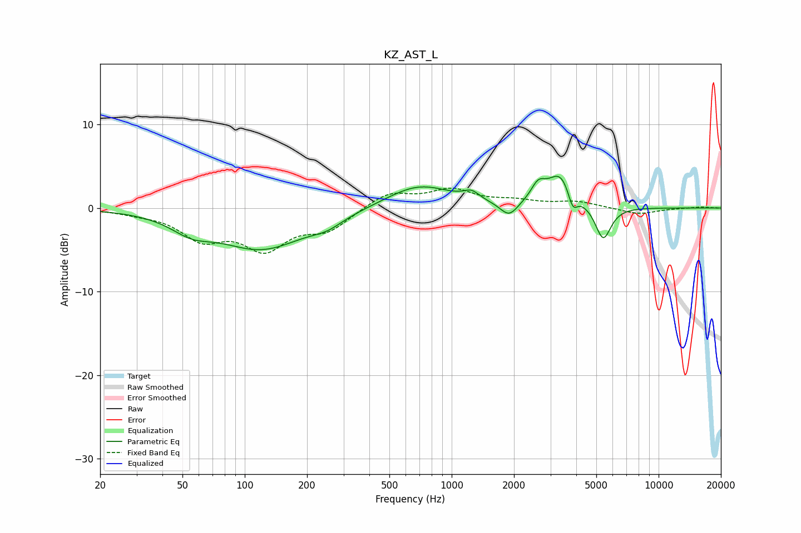

# KZ_AST_L
See [usage instructions](https://github.com/jaakkopasanen/AutoEq#usage) for more options and info.

### Parametric EQs
Apply preamp of -3.9 dB when using parametric equalizer.

|   # | Type    |   Fc (Hz) |    Q |   Gain (dB) |
|-----|---------|-----------|------|-------------|
|   1 | Peaking |        55 | 1.46 |        -1.7 |
|   2 | Peaking |       121 | 0.67 |        -4.8 |
|   3 | Peaking |       250 | 1.83 |        -1   |
|   4 | Peaking |       696 | 0.89 |         2.8 |
|   5 | Peaking |      1248 | 3.67 |         1   |
|   6 | Peaking |      1893 | 3.3  |        -1.8 |
|   7 | Peaking |      2618 | 4.07 |         1.9 |
|   8 | Peaking |      3362 | 2.27 |         4.1 |
|   9 | Peaking |      3845 | 6    |        -2.3 |
|  10 | Peaking |      5396 | 3.68 |        -4.1 |

### Fixed Band EQs
When using fixed band (also called graphic) equalizer, apply preamp of **-2.5 dB** (if available) and set gains manually with these parameters.

|   # | Type    |   Fc (Hz) |    Q |   Gain (dB) |
|-----|---------|-----------|------|-------------|
|   1 | Peaking |        31 | 1.41 |        -0.4 |
|   2 | Peaking |        62 | 1.41 |        -3.3 |
|   3 | Peaking |       125 | 1.41 |        -4.4 |
|   4 | Peaking |       250 | 1.41 |        -2.4 |
|   5 | Peaking |       500 | 1.41 |         1.9 |
|   6 | Peaking |      1000 | 1.41 |         2   |
|   7 | Peaking |      2000 | 1.41 |         0.7 |
|   8 | Peaking |      4000 | 1.41 |         0.7 |
|   9 | Peaking |      8000 | 1.41 |        -0.8 |
|  10 | Peaking |     16000 | 1.41 |         0.1 |

### Graphs

