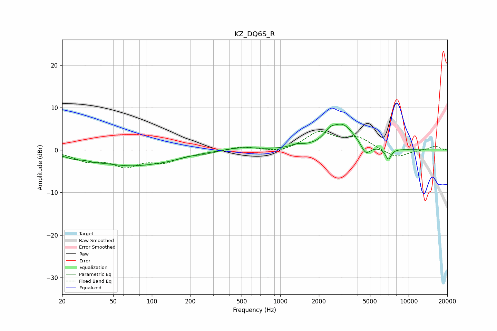

# KZ_DQ6S_R
See [usage instructions](https://github.com/jaakkopasanen/AutoEq#usage) for more options and info.

### Parametric EQs
Apply preamp of -6.2 dB when using parametric equalizer.

|   # | Type    |   Fc (Hz) |    Q |   Gain (dB) |
|-----|---------|-----------|------|-------------|
|   1 | Peaking |        24 | 2.12 |        -0.7 |
|   2 | Peaking |        36 | 2.51 |        -0.4 |
|   3 | Peaking |        67 | 0.53 |        -3.5 |
|   4 | Peaking |       136 | 1.09 |        -0.6 |
|   5 | Peaking |       493 | 1.27 |         0.7 |
|   6 | Peaking |      1346 | 2.94 |         0.7 |
|   7 | Peaking |      2428 | 3.53 |         1.6 |
|   8 | Peaking |      3059 | 1.46 |         5.8 |
|   9 | Peaking |      4633 | 3.77 |        -2.6 |
|  10 | Peaking |      6950 | 6    |        -2.6 |

### Fixed Band EQs
When using fixed band (also called graphic) equalizer, apply preamp of **-4.5 dB** (if available) and set gains manually with these parameters.

|   # | Type    |   Fc (Hz) |    Q |   Gain (dB) |
|-----|---------|-----------|------|-------------|
|   1 | Peaking |        31 | 1.41 |        -2.2 |
|   2 | Peaking |        62 | 1.41 |        -3.3 |
|   3 | Peaking |       125 | 1.41 |        -2.4 |
|   4 | Peaking |       250 | 1.41 |        -0.7 |
|   5 | Peaking |       500 | 1.41 |         0.9 |
|   6 | Peaking |      1000 | 1.41 |        -0.7 |
|   7 | Peaking |      2000 | 1.41 |         4.1 |
|   8 | Peaking |      4000 | 1.41 |         2.7 |
|   9 | Peaking |      8000 | 1.41 |        -1.9 |
|  10 | Peaking |     16000 | 1.41 |         1   |

### Graphs

