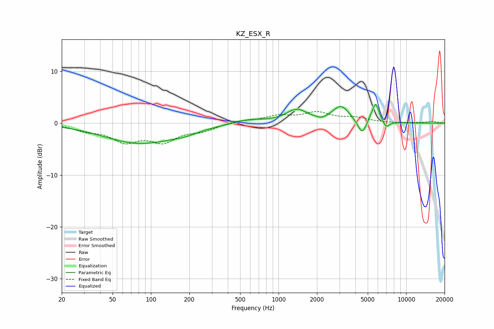

# KZ_ESX_R
See [usage instructions](https://github.com/jaakkopasanen/AutoEq#usage) for more options and info.

### Parametric EQs
Apply preamp of -3.7 dB when using parametric equalizer.

|   # | Type    |   Fc (Hz) |    Q |   Gain (dB) |
|-----|---------|-----------|------|-------------|
|   1 | Peaking |        81 | 0.51 |        -3.8 |
|   2 | Peaking |       183 | 1.23 |        -0.7 |
|   3 | Peaking |       585 | 1.23 |         0.8 |
|   4 | Peaking |      1388 | 1.69 |         2.5 |
|   5 | Peaking |      2168 | 3.87 |        -0.4 |
|   6 | Peaking |      3084 | 2.18 |         3.1 |
|   7 | Peaking |      4517 | 4.26 |        -2.8 |
|   8 | Peaking |      5391 | 4.82 |         1   |
|   9 | Peaking |      5800 | 5.89 |         3.2 |
|  10 | Peaking |      7006 | 5.98 |        -1.1 |

### Fixed Band EQs
When using fixed band (also called graphic) equalizer, apply preamp of **-2.3 dB** (if available) and set gains manually with these parameters.

|   # | Type    |   Fc (Hz) |    Q |   Gain (dB) |
|-----|---------|-----------|------|-------------|
|   1 | Peaking |        31 | 1.41 |        -1.2 |
|   2 | Peaking |        62 | 1.41 |        -3.2 |
|   3 | Peaking |       125 | 1.41 |        -3.2 |
|   4 | Peaking |       250 | 1.41 |        -1.2 |
|   5 | Peaking |       500 | 1.41 |         0.5 |
|   6 | Peaking |      1000 | 1.41 |         1.3 |
|   7 | Peaking |      2000 | 1.41 |         1.9 |
|   8 | Peaking |      4000 | 1.41 |         0.9 |
|   9 | Peaking |      8000 | 1.41 |        -0   |
|  10 | Peaking |     16000 | 1.41 |         0.3 |

### Graphs

